* [并发基础](#%E5%B9%B6%E5%8F%91%E5%9F%BA%E7%A1%80)
  * [线程基本概念](#%E7%BA%BF%E7%A8%8B%E5%9F%BA%E6%9C%AC%E6%A6%82%E5%BF%B5)
    * [创建线程](#%E5%88%9B%E5%BB%BA%E7%BA%BF%E7%A8%8B)
    * [线程基本属性和方法](#%E7%BA%BF%E7%A8%8B%E5%9F%BA%E6%9C%AC%E5%B1%9E%E6%80%A7%E5%92%8C%E6%96%B9%E6%B3%95)
    * [共享内存](#%E5%85%B1%E4%BA%AB%E5%86%85%E5%AD%98)
      * [竞态条件](#%E7%AB%9E%E6%80%81%E6%9D%A1%E4%BB%B6)
      * [内存可见性](#%E5%86%85%E5%AD%98%E5%8F%AF%E8%A7%81%E6%80%A7)
  * [线程安全](#%E7%BA%BF%E7%A8%8B%E5%AE%89%E5%85%A8)
    * [线程安全分类](#%E7%BA%BF%E7%A8%8B%E5%AE%89%E5%85%A8%E5%88%86%E7%B1%BB)
      * [不可变 (Immutable)](#%E4%B8%8D%E5%8F%AF%E5%8F%98-immutable)
      * [绝对线程安全](#%E7%BB%9D%E5%AF%B9%E7%BA%BF%E7%A8%8B%E5%AE%89%E5%85%A8)
      * [相对线程安全](#%E7%9B%B8%E5%AF%B9%E7%BA%BF%E7%A8%8B%E5%AE%89%E5%85%A8)
      * [线程兼容](#%E7%BA%BF%E7%A8%8B%E5%85%BC%E5%AE%B9)
      * [线程对立](#%E7%BA%BF%E7%A8%8B%E5%AF%B9%E7%AB%8B)
    * [线程安全的实现](#%E7%BA%BF%E7%A8%8B%E5%AE%89%E5%85%A8%E7%9A%84%E5%AE%9E%E7%8E%B0)
  * [锁优化](#%E9%94%81%E4%BC%98%E5%8C%96)
    * [自旋锁与自适应自旋 (Adaptive Spinning)](#%E8%87%AA%E6%97%8B%E9%94%81%E4%B8%8E%E8%87%AA%E9%80%82%E5%BA%94%E8%87%AA%E6%97%8B-adaptive-spinning)
    * [锁消除 (Lock Elimination)](#%E9%94%81%E6%B6%88%E9%99%A4-lock-elimination)
    * [锁粗化 (Lock Coarsening)](#%E9%94%81%E7%B2%97%E5%8C%96-lock-coarsening)
    * [轻量级锁 (Lightweight Locking)](#%E8%BD%BB%E9%87%8F%E7%BA%A7%E9%94%81-lightweight-locking)
    * [偏向锁 (Biased Locking)](#%E5%81%8F%E5%90%91%E9%94%81-biased-locking)
  * [java内存模型(JMM)](#java%E5%86%85%E5%AD%98%E6%A8%A1%E5%9E%8Bjmm)
  * [volatile](#volatile)
  * [synchronized](#synchronized)
    * [修饰实例方法](#%E4%BF%AE%E9%A5%B0%E5%AE%9E%E4%BE%8B%E6%96%B9%E6%B3%95)
    * [修饰静态方法](#%E4%BF%AE%E9%A5%B0%E9%9D%99%E6%80%81%E6%96%B9%E6%B3%95)
    * [修饰代码块](#%E4%BF%AE%E9%A5%B0%E4%BB%A3%E7%A0%81%E5%9D%97)
  * [死锁](#%E6%AD%BB%E9%94%81)
  * [CountDownLatch](#countdownlatch)
  * [CyclicBarrier](#cyclicbarrier)
  * [Semaphore](#semaphore)
  * [中断](#%E4%B8%AD%E6%96%AD)
* [并发包基础](#%E5%B9%B6%E5%8F%91%E5%8C%85%E5%9F%BA%E7%A1%80)
  * [自旋锁](#%E8%87%AA%E6%97%8B%E9%94%81)
  * [独占锁/共享锁](#%E7%8B%AC%E5%8D%A0%E9%94%81%E5%85%B1%E4%BA%AB%E9%94%81)
  * [公平锁/非公平锁](#%E5%85%AC%E5%B9%B3%E9%94%81%E9%9D%9E%E5%85%AC%E5%B9%B3%E9%94%81)
  * [可重入锁/递归锁](#%E5%8F%AF%E9%87%8D%E5%85%A5%E9%94%81%E9%80%92%E5%BD%92%E9%94%81)
  * [原子变量和CAS](#%E5%8E%9F%E5%AD%90%E5%8F%98%E9%87%8F%E5%92%8Ccas)
  * [显式锁/ReentrantLock](#%E6%98%BE%E5%BC%8F%E9%94%81reentrantlock)
  * [synchronized与ReentrantLock区别](#synchronized%E4%B8%8Ereentrantlock%E5%8C%BA%E5%88%AB)
  * [显式条件](#%E6%98%BE%E5%BC%8F%E6%9D%A1%E4%BB%B6)
  * [阻塞队列](#%E9%98%BB%E5%A1%9E%E9%98%9F%E5%88%97)
  * [生产者/消费者](#%E7%94%9F%E4%BA%A7%E8%80%85%E6%B6%88%E8%B4%B9%E8%80%85)
    * [wait/notifyAll/synchronized](#waitnotifyallsynchronized)
    * [await/singalAll/ReentrantLock](#awaitsingalallreentrantlock)
    * [阻塞队列](#%E9%98%BB%E5%A1%9E%E9%98%9F%E5%88%97-1)
  * [线程池](#%E7%BA%BF%E7%A8%8B%E6%B1%A0)
    * [线程池架构](#%E7%BA%BF%E7%A8%8B%E6%B1%A0%E6%9E%B6%E6%9E%84)
    * [java获取线程池](#java%E8%8E%B7%E5%8F%96%E7%BA%BF%E7%A8%8B%E6%B1%A0)
    * [ThreadPoolExecutor](#threadpoolexecutor)
      * [corePoolSize](#corepoolsize)
      * [maximumPoolSize](#maximumpoolsize)
      * [keepAliveTime](#keepalivetime)
      * [unit](#unit)
      * [workQueue](#workqueue)
      * [threadFactory](#threadfactory)
      * [handler](#handler)
    * [线程池工作原理](#%E7%BA%BF%E7%A8%8B%E6%B1%A0%E5%B7%A5%E4%BD%9C%E5%8E%9F%E7%90%86)
      * [拒绝策略](#%E6%8B%92%E7%BB%9D%E7%AD%96%E7%95%A5)
    * [生产实际](#%E7%94%9F%E4%BA%A7%E5%AE%9E%E9%99%85)
  * [java\.lang\.ThreadLocal](#javalangthreadlocal)

## 并发基础

### 线程基本概念

#### 创建线程

- 进程是操作系统分配资源的基本单位，线程是`CPU`调度的基本单位，一个进程至少一个线程。

- 线程表示一条单独的执行流，它有自己的程序执行计数器，有自己的栈，。在`java`中获取线程的4方式：
  1. 继承`Thread`类；
  
  2. 实现`Runnable`接口;
  
  3. **实现`Callable`接口**
  
     ```java
     class  MyThread1 implements Callable<Integer> {
     
         @Override
         public Integer call() throws Exception {
             System.out.println("进入callable");
             TimeUnit.SECONDS.sleep(3);
             return 1024;
         }
     }
     public class CallableDemo {
         /**
          *  result:
          *      进入callable
          *      main运行
          *      result：1024
          */
         public static void main(String[] args) throws ExecutionException, InterruptedException {
             // 1.new Thread()需传一个实现Runnable接口的参数，
             // 2.RunnableFuture接口继承了Runnable接口,
             // 3.FutureTask类实现了RunnableFuture接口
             // 4.FutureTask构造方法参数又为Callable接口(适配器模式)，
             // 所以用FutureTask来创建线程
             //FutureTask的泛型类型就是Callable的泛型类型
             FutureTask<Integer> futureTask = new FutureTask<>(new MyThread1());
             //如果多个线程，共用一个futureTask,计算结果只算一次(这里AAA和BBB两个线程都启动，只会调用一次MyThread1的call方法)
             new Thread(futureTask,"AAA").start();
             new Thread(futureTask,"BBB").start();
     
             //futureTask.get()就是获得Callable的计算结果，尽量放在较后执行，不要阻塞其他线程。因为如果没有计算完成，会导致其他线程阻塞来等待这个计算结果，直到计算完成
             //比如这里，Callable中睡眠3s，get()这里就会阻塞3s,3s之后才会打印“main运行”
             int result = futureTask.get();
     
             System.out.println(Thread.currentThread().getName()+"运行");
             System.out.println("result："+(result));
         }
     }
     ```
  
     
  
  4. **线程池**
  
- `Runnable`与`Callable`区别

  1. 实现`Runnable`接口的`run()`方法没有返回值，实现`Callable`接口的`call()`方法有返回值。
  2. 实现`Runnable`接口的`run()`方法不会抛异常，实现`Callable`接口的`call()`方法要抛异常。

#### 线程基本属性和方法

- 状态

1. `new`：创建后尚未启动，没有调用`start`的线程状态
2. `terminated`：线程运行结束后的状态
3. `runnable`：调用`start`后在执行`run`方法且没有阻塞时的状态，可能正在执行，也可能等待`CPU`分配时间
4. `blocked`：线程在等待获取排他锁
5. `waiting`：无限期等待，不会被`CPU`分配时间，需要等待被其他线程显式唤醒
6. `timed_waiting`：限期等待，也不会被`CPU`分配时间，一定时间后由系统自动唤醒

- `daemon`属性

  - 守护线程，为其他线程提供服务，不是不可或缺，被守护线程结束时，守护线程也会退出。

  - 注意：
  - `setDaemon(true)`必须在`start()`前设置，不能把正在运行的常规线程设置为守护线程。
    - 守护线程永远不会访问固定资源，比如文件、数据库，因为它随时可能退出。
  
- `sleep`方法

  - 让当前线程睡眠指定时间，**不会释放锁，会让出CPU进入阻塞态**，任何优先级线程都能得到执行机会。如果被中断，会抛出`InterruptedException`。

- `yield`方法

  - 只能让**拥有相同优先级的线程**获取CPU的机会，**不会释放锁，会让出CPU**，进入**就绪态**，只需等待重新获取CPU执行时间。

- `join`

  - `join`方法的主要作用就是同步，它可以使得线程之间的并行执行变为串行执行。在A线程中调用了B线程的`join()`方法时，表示只有当B线程执行完毕时，A线程才能继续执行。
  
- `wait/notify`

  - 除了用于锁的等待队列，每个对象还有一个条件队列，用于线程间的协作。`wait`会把当前线程放到条件队列上并阻塞，它需要等待一个条件，这个条件需要其他线程改变；`notify`就是从条件队列中选一个线程，将其从队列中移除并唤醒。`wait`执行过程：

  1. 当前线程放入条件等待队列，**释放对象锁**，阻塞等待，线程状态变为`waiting`或`timed_waiting`
  2. 等待时间到或被其他线程调用`notify/notifyAll`从条件队列移除，这是重新竞争对象锁：
     1. 如果能够获得对象锁：线程转态变为`runnable`，并从`wait`调用中返回。
     2. 否则，进入对象锁的等待队列，线程状态变为`blocked`，获得锁后才会从`wait`调用中返回。

#### wait VS sleep

1. `sleep`是`Thread`类的方法，会让线程暂停执行指定时间，将CPU让给其他线程，不会释放锁，线程进入`timed_waiting`状态，指定时间结束后自动恢复。
2. `wait`是`Object`类的方法，`wait`会让当前线程释放锁，进入等待队列，后续由`notify/notifyAll`唤醒。

#### 共享内存

##### 竞态条件

- 线程的执行时序影响结果。

##### 内存可见性

- 在计算机系统中，数据可以写到内存、缓存、CPU寄存器，访问一个变量时，可能直接从缓存或寄存器中取，而不一定从内存取，修改一个变量时，也可能先写到缓存，稍后才会同步更新到内存中。多线程环境下，一个线程对内存的修改，可能没及时同步到内存，别的线程也可能没从内存读，所以导致别的线程看不到它的修改。

- 解决方案：`volatile`；`synchronized`；显式锁；`final`

- 多线程优缺点
  - 充分利用多CPU的计算能力及硬件资源
  - 用户界面程序或服务器应用程序中可以提升用户体验
  - 创建、调度、切换需要消耗资源

### 线程安全

- 线程安全

  > ​		当多个线程访问一个对象时，如果不考虑这些线程在运行时环境下的调度和交替执行，也不需要进行额外的同步，或者在调用方法进行任何其他的协调操作，调用这个对象的行为都可以获得正确的结果，那么这个对象就是线程安全的。

#### 线程安全分类

##### 不可变 (`Immutable`)

- 不可变的对象一定是线程安全的，不需要加任何线程安全保障措施。
- 如果共享数据是基本数据类型，那么定义时加`final`修饰即可保证不可变。
- `java API`中的不可变类型：`java.lang.String`、`java.lang.Long`、`java.lang.Double`

##### 绝对线程安全

 - 绝对线程安全要满足上述定义，有些类是线程安全，但不是绝对线程安全，比如`java.util.Vector`：

   - 尽管`get()`，`remove()`，`size()`方法都是同步的，但调用端没有做额外的同步措施：

   ```java
   public class AbsoluteThreadSafety {
       private static Vector<Integer> vector = new Vector<>();
       /**
        * result:
        *      java.lang.ArrayIndexOutOfBoundsException: Array index out of range:
        * @param args
        */
       public static void main(String[] args) {
           while (true){
               for (int i = 0; i < 10; i++) {
                   vector.add(i);
               }
               Thread removeThread = new Thread(()->{
                   for (int i = 0; i < vector.size(); i++) {
                       vector.remove(i);
                   }
               });
               Thread printThread = new Thread(()->{
                   for (int i = 0; i < vector.size(); i++) {
                       System.out.println(vector.get(i));
                   }
               });
               removeThread.start();
               printThread.start();
           }
       }
   }
   
   ```

   - 正确写法要加上`synchronized`同步：

     ```java
     public class AbsoluteThreadSafety {
         private static Vector<Integer> vector = new Vector<>();
         
         public static void main(String[] args) {
             while (true){
                 for (int i = 0; i < 10; i++) {
                     vector.add(i);
                 }
                 Thread removeThread = new Thread(()->{
                     synchronized (vector){
                         for (int i = 0; i < vector.size(); i++) {
                             vector.remove(i);
                         }
                     }
                 });
                 Thread printThread = new Thread(()->{
                     synchronized (vector){
                         for (int i = 0; i < vector.size(); i++) {
                             System.out.println(vector.get(i));
                         }
                     }
                 });
                 removeThread.start();
                 printThread.start();
             }
         }
     }
     ```

##### 相对线程安全

- 相对线程安全即通常意义上的线程安全，它需要保证这个对象单独的操作时线程安全的，调用时不需要做额外的保障措施，但对于一些特定顺序的连续调用，还需要在调用端使用同步手段。比如`java.lang.Vector`，`java.util.HashTable`等。

##### 线程兼容

- 指对象本身不是线程安全，但可以通过在调用端正确的使用同步手段来保证对象在并发环境中可以安全使用。比如`java.util.ArrayList`，`java.util.HashMap`。

##### 线程对立

- 指无论是否采取同步措施，都无法在多线程环境中并发使用的代码。比如`Thread.suspend()`和`Thread.resume()`方法，`System.setIn()`,`System.setOut()`，`System.runFinalizersOnExit()`等

#### 线程安全的实现

 - 互斥同步(也称阻塞同步)
   - 同步：多个线程并发访问共享数据数，保证共享数据在同一时刻只被一个线程使用。
   - 互斥：互斥是实现同步的一种手段。临界区(`Section`)、互斥量(`Mutex`)、信号量(`Semaphore`)是互斥的实现方式。互斥是方法，同步是目的。
   - 互斥同步属于一种悲观的并发策略，认为只要不去做正确的同步措施，就肯定会出问题，无论共享数据是否真的会出现竞争，它都要进行加锁。
   - `synchronized`：**`synchronized`是最基本的互斥同步手段，`synchronized`经过编译之后，会在同步块的前后分别形成`monitorenter`和`monitorexit`两个字节码指令，这两个字节码都需要一个`reference`类型的参数来指明要锁定和解锁的对象。如果`java`程序中的`synchronized`明确指定了对象参数，那么就是这个对象的`reference`；如果没有明确指定，就根据`synchronized`修饰的是实例方法还是类方法，去取对应的对象实例或`Class`对象来作为锁对象。**
   - `synchronized`重量级锁原因：**同步块在已进入的线程执行完之前，会阻塞后面其他线程的进入。而`java`的线程时映射到操作系统的原生线程之上的，如果要阻塞或唤醒一个线程，都需要操作系统来帮忙完成，这就需要从用户态转换到内核态，因此状态转换需要耗费很多的处理器时间。**
   - 另一个实现互斥同步方法是`ReentrantLock`。
 - 非阻塞同步
   	- 非阻塞同步属于一种乐观的并发策略，即先进行操作，如果没有其他线程争用共享数据，那操作就成功了，如果共享数据有争用，产生了冲突，再采取补偿措施。
   	- `CAS`
- 无同步方案
  - 可重入代码(`Reentrant Code`)
    - 如果一个方法它的结果是可以预测的，只要输入了相同的数据，就都能返回相同的结果，就满足可重入性。
    - 可重入的代码都是线程安全的，线程安全的代码不一定都可重入。
  - 线程本地存储(`Thread Local Storage`)
    - 如果一段代码中所需要的数据必须与其他代码共享，那就看这些共享数据的代码能否保证在同一个线程中执行？如果能，就可以把共享数据的可见性控制在同一个线程之内，这样无需共享也能保住线程之间不出现数据争用问题。

### 锁优化 

#### 自旋锁与自适应自旋 (`Adaptive Spinning`)

- 自旋锁
  - 自旋锁是一种非阻塞锁，如果某线程需要获取锁，但该锁已被其他线程占用时，该线程不会挂起，而是在不断地消耗`CPU`时间，不停的试图获取锁。
  - 线程的挂起和恢复操作都要转入内核态中完成，这给系统的并发性带来很大压力，而许多应用中共享数据的锁定状态只会持续很短的一段时间，为了这段时间去挂起和恢复线程不值得。
  - 自旋锁在`jdk 1.4`已经引入，默认关闭，通过`-XX:+UseSpinning`开启，`jdk1.6`中默认开启。
  - 缺点：如果锁被占用的时间很长，那么自旋的线程只会白白消耗处理器资源，带来性能上的浪费。
- 自适应的自旋锁
  - 即自旋的时间不再固定了，而是由前一次在同一个锁上的自旋时间及锁的拥有者的状态来决定。

#### 锁消除 (`Lock Elimination`)

- 指`jvm`即时编译器在运行时，对一些在代码上要求同步，但是被检测到不可能存在共享数据竞争的锁进行消除。
- 锁消除的判断依据是逃逸分析，如果在一段代码中，堆上的所有数据都不会逃逸出去从而被其他线程访问到，那么就把它当栈上的数据对待，认为是私有的，同步加锁就无法进行。

#### 锁粗化 (`Lock Coarsening`)

- 大部分情况下，推荐将同步块的作用范围限制得尽量小--只在共享数据的实际作用域中才进行同步，这样使需要同步的操作数量尽可能小，如果存在锁竞争，等待锁的线程能尽快拿到锁。
- 如果`jvm`探测到有一串零碎的操作都对同一个对象加锁，将会把加锁同步的范围扩展(粗化)到整个操作序列外部。
- 比如一个`StringBuffer`对象多次连续调用`append()`方法，那么锁就会扩展到第一个`append()`操作之前直至最后一个`append()`操作之后，这样就只需加一次锁。

#### 轻量级锁 (`Lightweight Locking`)

- `jdk1.6`加入的新型锁机制。指在没有多线程竞争的前提下，减少传统的重量级锁使用操作系统互斥量产生的性能消耗，并不是用来替代重量级锁。
	- 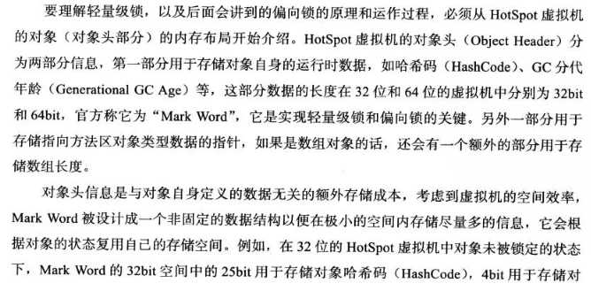
	- 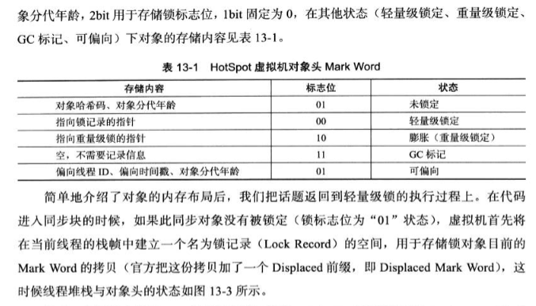
	- 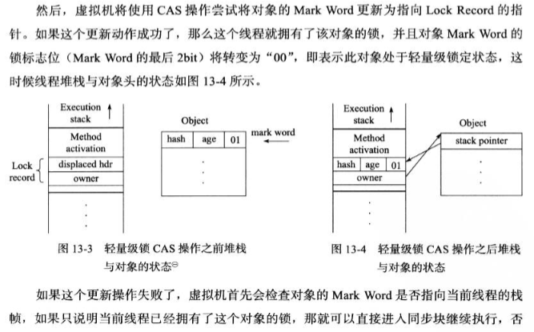
	- 

#### 偏向锁 (`Biased Locking`)

- `jdk1.6`引入的锁优化。消除数据在无竞争情况下的同步原语，进一步提高程序性能。
- 如果说**轻量级锁是在无竞争情况下使用`CAS`操作去消除同步使用的互斥量**，那**偏向锁就是在无竞争情况下把整个同步都消掉，连`CAS`操作都不做了**。
- 偏向锁的偏指会偏向于第一个获得它的线程。如果在后续执行过程中，该锁没有被其他线程获取，则持有偏向锁的线程将永远不需要再进行同步。
- 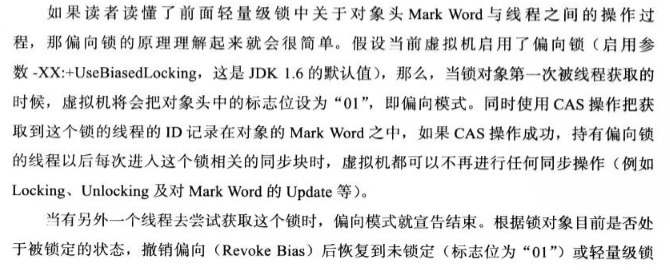

- 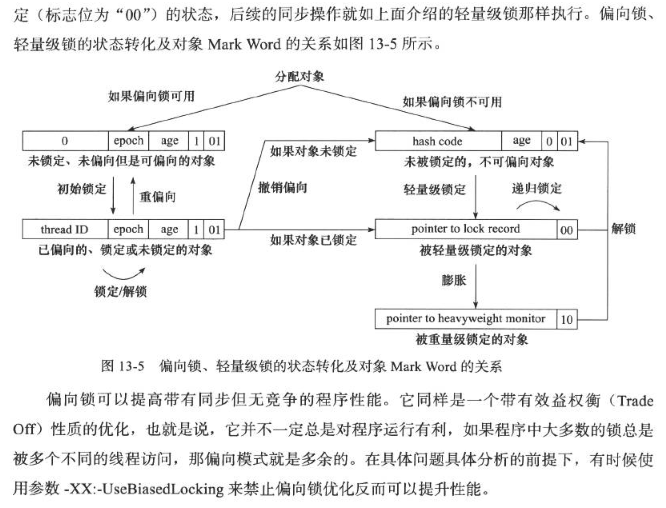

### java内存模型(JMM)

- `C/C++`等语言直接使用物理硬件和操作系统的内存模型，那么就要针对不同的平台编写不同的程序。而`java`定义了`JMM`来屏蔽掉各种硬件和操作系统的内存访问差异，因此`java`程序能够在各种平台下都能达到一致的内存访问效果。

-  **`JMM`本身是一种抽象的概念并不真实存在，主要目标是定义程序中各个**共享**变量的访问规则。**

- **`JMM`规定所有的变量都存储在主内存中，每个线程还有自己的工作内存，线程的工作内存中保存了被该线程使用到的变量的主内存副本拷贝。线程对变量的所有操作需在工作内存中进行，不能直接读写主内存中的变量。不同线程之间也不能直接互相访问工作内存中的变量，线程间变量的传递均需通过主内存来完成。**
- `JMM`规定的可见性、原子性、有序性，`volatile`只能保证其中两个，`synchronized`都能满足。

- JMM对于同步的规定：

1. 线程解锁前，必须把共享变量的值刷新回主内存。

2. 线程加锁前，必须读取主内存的最新值到自己的工作内存。

3. 加锁解锁是同一把锁。

   - 主内存与工作内存之间具体的交互协议，`JMM`定义了8种操作来完成，每种操作都是原子的：

   |        | 工作内存                                     | 主内存                                                       |
   | ------ | :------------------------------------------- | :----------------------------------------------------------- |
   | lock·  |                                              | 把一个变量标识为一条线程独占的状态                           |
   | unlock |                                              | 把一个处于锁定状态的变量释放出来，释放后的变量才可以被其他线程锁定 |
   | read   |                                              | 把一个变量的值从主内存传输到工作内存                         |
   | load   | 把read操作得到的值放入工作内存变量副本中     |                                                              |
   | use    | 把工作内存中一个变量值传递给执行引擎         |                                                              |
   | assign | 把一个从执行引擎接收到的值赋给工作内存的变量 |                                                              |
   | store  | 把工作内存中一个变量的值传输到主内存中       |                                                              |
   | write  |                                              | 把store操作从工作内存中得到的变量值放入主内存变量中          |

### volatile

- volatile是`jvm`提供的最轻量级的同步机制

- 保证内存可见性

  - 当某一条线程修改了这个变量值，新值对于其他线程来说是立即可以得知的。

- 不保证原子性

  > 代码实例

  ```java
  class MyData{
      //共享变量
      volatile int number = 0;
  
      public void addTo100(){
          this.number = 100;
      }
  
      public  void  addPlus(){
          number ++;
      }
  }
  
  public class VolatileDemo {
      public static void main(String[] args) {
          //保证可见性
          //seeOkByVolatile();
  
          //不保证原子性
          //atomicNotOkByVolatile();
      }
  
      /**
       * 验证volatile可以保证可见性，及时通知其他线程，主物理内存的值已经被修改
       *
       * result1(MyData中number没有volatile修饰):
       *      AAA	 come in
       *      AAA	 update number
       * result2(MyData中number有volatile修饰)：
       *      AAA	 come in
       *      AAA	 update number
       *      main	 mission is over，main get number:100
       */
      private static void seeOkByVolatile() {
          //资源类
          MyData myData = new MyData();
  
          //AAA线程进来停3s,再修改number值为100
          new Thread(()->{
              System.out.println(Thread.currentThread().getName()+"\t come in");
              try {
                  TimeUnit.SECONDS.sleep(3);
              } catch (InterruptedException e) {
                  e.printStackTrace();
              }
              //AAA线程修改number值
              myData.addTo100();
              System.out.println(Thread.currentThread().getName()+"\t update number");
          },"AAA").start();
  
          //第2个线程就是main线程
          while (myData.number == 0){
              //main线程一直在这里循环等待，直到number值不等于0，
              // 如果有volatile保证可见性，那么a线程把number改为100main线程就可以知道，程序就会结束。
              // 如果没有volatile保证可见性，那么a线程把number改为100main线程不知道，就会陷入这个死循环，程序不会结束。
          }
          System.out.println(Thread.currentThread().getName()+"\t mission is over，main get number:"+myData.number);
      }
  
      /**
       * 原子性：不可分割，完整性，某个线程做某个具体业务是，中间不可以加塞或分割，要么同时成功，要么同时失败
       * 即使给MyData中number加上volatile修饰，执行结果也每次都不一样
       * 解决办法：使用AtomicInteger
       */
      private static void atomicNotOkByVolatile() {
          //资源类
          MyData myData = new MyData();
          //20个线程，每个线程执行1000次 ++ 操作
          for (int i = 0; i < 20; i++) {
              new Thread(()->{
                  for (int j = 0; j < 1000; j++) {
                      myData.addPlus();
                  }
              },String.valueOf(i)).start();
          }
          //需要等待上面20个线程全部计算完
          while (Thread.activeCount() > 2){
              Thread.yield();
          }
  
          System.out.println(Thread.currentThread().getName()+"\tfinally number value："+myData.number);
      }
  }
  
  ```

  

- 禁止指令重排

  - 从硬件架构来讲，指令重排是CPU采用了允许将多条指令不按程序规定的顺序分开发送给各相应电路单元处理。计算机在执行程序时，为了提高性能，编译器和处理器常常会对指令做重排，单线程环境里面确保程序最终执行结果和代码顺序执行的结果一致。处理器在进行重排序时必须要考虑指令间的数据依赖性。多线程环境中线程交替执行，由于编译器优化重排的存在，两个线程中使用的变量能否保证一致性是无法确定的，结果无法预测。

   - 反汇编`volatile`修饰的变量可以发现多了一个内存屏障。
   - 内存屏障(`memory barrier`)，又称内存栅栏，是一个CPU指令，两个作用：
       1. 保证特定操作的执行顺序
       2. 保证某些变量的内存可见性(利用该特性实现`volatile`的内存可见性)。
   - 由于编译器和处理器都能执行指令重排优化，如果在指令间插入一条`memory barrier`则会告诉编译器和`CPU`，不管什么指令都不能和这个`memory barrier`指令重排序，也就是说，通过插入内存屏障禁止在内存屏障前后的指令执行重排序。内存屏障另一个作用是强制刷新任何CPU中的缓存数据，因此任何`CPU`上的线程都能读取到这些数据的最新版本。
     - 对`volatile`变量进行写操作时，会在写操作后加入一条`store`屏障指令，将工作内存中的共享变量值刷新回主内存；对`volatile`变量进行读操作时，会在读操作前加入一条`load`屏障指令，从主内存中读取共享变量。

### synchronized

- `synchronized`可以保证被他修饰的方法或代码块在同一时间只能被一个线程访问。 
- 早期版本的`synchronized`效率较低，因为监视器锁(`monitor`)是依赖于操作系统的`Mutex Lock`之上的，java的线程是映射到操作系统原生线程之上的，如果要挂起或唤醒一个线程，需要操作系统来帮忙，而操作系统实现线程的切换需要用户态与内核态之间的转换，所以效率低下。

- `synchronized`可修饰**实例方法**、**静态方法**、**代码块**

#### 修饰实例方法

```java
public class Counter extends Thread{
    private int count;
    //加了synchronized后，方法内的代码就变成了原子操作。
    public synchronized void incr(){
        count ++;
    }
    public synchronized int getCount(){
        return count;
    }
}
```

- 此时，synchronized保护的是**当前实例对象，即this，多个线程可以同时执行同一个synchronized实例方法，只要它们访问的对象不同即可**。比如：

```java
Counter counter1 = new Counter();
Counter counter2 = new Counter();
Thread t1 = new CounterThread(counter1);
Thread t2 = new CounterThread(counter2);
t1.start();
t2.start();
```

- 对于同一个`Counter`对象，一个线程执行`incr()`方法，另一个线程执行`getCount()`方法，它们是不能同时执行的。

- this对象有一个锁和一个等待队列，锁只能被一个线程持有，线程执行synchronized实例方法时，尝试获得锁，如果获得，继续下一步；如果不能获得，加入等待队列，阻塞并等待唤醒。

#### 修饰静态方法

```java
public class Counter {
    private static int count = 0;
    public static synchronized void incr(){
        count ++;
    }
    public static synchronized int getCount(){
        return count;
    }
}
```

- 此时，synchronized保护的是**类对象，即`Counter.class`，synchronized实例方法和synchronized静态方法保护的是不同对象，不同两个线程可以一个执行synchronized静态方法，另一个执行synchronized实例方法。**

#### 修饰代码块

- 如下：等价于上面的修饰实例方法

```java
public class Counter {
    private int count = 0;
    public void incr(){
        synchronized (this){
            count ++;
        }
    }
    public int getCount(){
        synchronized(this){
            return count;
        }
    }
}

```

- 如下：等价于上面的修饰静态方法

```java
public class Counter {
    private static int count;
    public static void incr(){
        synchronized (Counter.class){
            count ++;
        }
    }
    public static int getCount(){
        synchronized(Counter.class){
            return count;
        }
    }
}

```

- `synchronized`几个特性
- 可重入性(可重入锁也叫递归锁)
    - `synchronized`是可重入的，即**对同一个执行线程，它在获得了锁之后，在调用其他需要同样锁的代码时，可以直接调用**。线程可以进入任何一个它已经拥有的锁所同步着的代码块。比如在一个`synchronized`实例方法内，可以直接调用其他`synchronized`实例方法。
    - 可重入是通过**记录锁的持有线程和持有数量来实现的**，当调用被`synchronized`保护的代码时，检查对象是否已经被锁，如果是，再检查是否被当前线程锁定，如果是，增加持有数量，如果不是被当前线程锁定，才加入等待队列，当释放锁时，减少持有数量，当数量变为`0`时才释放整个锁。
  
- 内存可见性
    - **synchronized除了保证原子操作外，还可以保证内存可见性，在释放锁时，所有写入都会写回内存，获得锁后，都会从内存中读最新数据。**

### 死锁 

- 线程`a`持有锁`A`，等待锁`B`；线程`b`持有锁`B`,等待锁`A`。`a、b`陷入互相等待，谁都执行不下去。

  ```java
  class HoldLockThread implements Runnable{
  
      private String lockA;
      private String lockB;
  
      public HoldLockThread(String lockA, String lockB) {
          this.lockA = lockA;
          this.lockB = lockB;
      }
  
      @Override
      public void run() {
          synchronized (lockA){
              System.out.println(Thread.currentThread().getName()+"\t自己持有"+lockA+"，尝试获得"+lockB);
  
              synchronized (lockB){
                  System.out.println(Thread.currentThread().getName()+"\t自己持有"+lockB+"，尝试获得"+lockB);
              }
          }
      }
  }
  public class DeadLockDemo {
      public static void main(String[] args) {
          String lockA = "lockA";
          String lockB = "lockB";
  
          new Thread(
              new HoldLockThread(lockA,lockB),
          "ThreadAAA").start();
  
          new Thread(
              new HoldLockThread(lockB,lockA)
          ,"ThreadBBB").start();
      }
  }
  ```

  

- 解决方案：改用显式锁或使用死锁检测工具`jstack`、`jps`等

### CountDownLatch

- **让一些线程阻塞直到另一些线程完成一系列操作后才被唤醒。**

- 主要有两个方法，当一个或多个线程调用`await`方法时，调用线程会被阻塞。其他线程调用`countDown`方法会将计数器减1(调用`countDown`方法的线程不会阻塞)，当计数器的值变为`0`时，因调用`await`方法被阻塞的线程会被唤醒，继续执行。

- ```java
  public class CountDownLatchDemo {
      /**
       * result:
       *  Thread-0执行完
       *  Thread-1执行完
       *  Thread-2执行完
       *  Thread-3执行完
       *  main开始执行
       */
      public static void main(String[] args) throws InterruptedException {
          CountDownLatch countDownLatch = new CountDownLatch(4);
          for (int i = 0; i < 4; i++) {
              new Thread(()->{
                  System.out.println(Thread.currentThread().getName()+"执行完");
                  countDownLatch.countDown();
              }).start();
          }
          countDownLatch.await();
          System.out.println(Thread.currentThread().getName()+"开始执行");
      }
  }
  ```

### CyclicBarrier

- 让一组线程到达一个屏障(或者叫同步点)时被阻塞，直到最后一个线程到达屏障时，屏障才会开门，所有被屏障拦截的线程才会继续干活，线程进入屏障通过`CyclicBarrier`的`await`方法。

- ```java
  public class CyclicBarrierDemo {
      public static void main(String[] args) {
          CyclicBarrier cyclicBarrier= new CyclicBarrier(7,()->{
              System.out.println("召唤神龙");
          });
          for (int i = 1; i < 8; i++) {
              final int tempInt  = i;
              new Thread(()->{
                  System.out.println(Thread.currentThread().getName() + "收集第"+ tempInt+"颗龙珠");
                  try {
                      cyclicBarrier.await();
                  } catch (Exception e) {
                      e.printStackTrace();
                  }
              },String.valueOf(tempInt)).start();
          }
      }
  }
  ```

### Semaphore

- 信号量主要用于两个目的，一个是用于**多个共享资源的互斥使用**，另一个用于**并发线程数的控制**。

- 默认非公平锁

- ```java
  public class SemaphoreDemo {
      /**
       * result:
       *  0	抢到车位
       *  1	抢到车位
       *  2	抢到车位
       *  0	离开车位
       *  1	离开车位
       *  2	离开车位
       *  4	抢到车位
       *  3	抢到车位
       *  4	离开车位
       *  3	离开车位
       */
      public static void main(String[] args) {
          Semaphore semaphore = new Semaphore(3);
          for (int i = 0; i < 5; i++) {
              new Thread(()->{
                  try {
                      semaphore.acquire();
                      System.out.println(Thread.currentThread().getName()+"\t抢到车位");
                      TimeUnit.SECONDS.sleep(3);
                      System.out.println(Thread.currentThread().getName()+"\t离开车位");
                  } catch (InterruptedException e) {
                      e.printStackTrace();
                  }finally {
                      semaphore.release();
                  }
              },String.valueOf(i)).start();
          }
      }
  }
  ```

### 中断

- 停止一个线程的主要机制是中断，中断并不是强迫终止一个线程，它是一种协作机制，是给线程传递一个取消信号，但是由线程来决定如何以及何时退出。	

- `Thread`类中定义的中断方法：
  - `isInterrupted`：返回对应线程中断标志位是否为`true`。
  - `interrupted`：返回对应线程中断标志位是否为`true`，并清空中断标志位(即如果连续两次调用，第1次为`true`，第2次就为`false`，除非同时又发生一次中断)。
  - `interrupt`：中断对应线程。

## 并发包基础

### 自旋锁

- 指尝试获取锁的线程不会立即阻塞，而是采用循环的方式去尝试获取锁。

- 好处：减少线程上下文切换的消耗

- 缺点：循环会消耗CPU。

  ```java
  public class SpinLockDemo {
      //原子引用线程
      AtomicReference<Thread> atomicReference = new AtomicReference<>();
  
      public void myLock(){
          Thread thread =Thread.currentThread();
          System.out.println(Thread.currentThread().getName() + "\tcome in");
          //如果比较并交换为true，取反就是false，那么就不会进入while块
          while (!atomicReference.compareAndSet(null,thread)){
              System.out.println(thread.getName() + "自旋");
          }
      }
      public void myUnLock(){
          Thread thread =Thread.currentThread();
          atomicReference.compareAndSet(thread,null);
          System.out.println(Thread.currentThread().getName() + "\tinvoke myUnLock");
      }
  
      /**
       * result:
       *  AAA	come in
       *  BBB	come in
       *  BBB自旋
       *  ...
       *  BBB自旋
       *  BBB	invoke myUnLock
       *  AAA	invoke myUnLock
       */
      public static void main(String[] args) {
          /**
           * 初始时，AAA线程获取锁，然后AAA睡眠3s，AAA获取锁1s后BBB尝试获取锁，此时锁还在AAA中
           * BBB进行自旋，等AAA释放锁后，BBB再获取锁
           */
          SpinLockDemo spinLockDemo = new SpinLockDemo();
          new Thread(()->{
              //AAA线程获取锁
              spinLockDemo.myLock();
              //AAA睡眠2s，即持有锁2s
              try {
                  Thread.sleep(2000);
              } catch (InterruptedException e) {
                  e.printStackTrace();
              }
              spinLockDemo.myUnLock();
          },"AAA").start();
  
          //AAA获取锁后1s，执行BBB线程
          try {
              Thread.sleep(1000);
          } catch (InterruptedException e) {
              e.printStackTrace();
          }
  
          new Thread(()->{
              //BBB线程想获取锁，但锁已被被AAA获取，AAA此时进入睡眠，所以BBB线程进行自旋
              //等到AAA释放锁后，BBB获取锁
              spinLockDemo.myLock();
              //BBB释放锁
              spinLockDemo.myUnLock();
          },"BBB").start();
  
      }
  }
  
  ```

  

### 独占锁/共享锁

- 独占锁：该锁一次只能被一个线程持有。`ReentrantLock`和`Synchronized`都是独占锁。

- 共享锁：该锁可被多个线程所持有。

- `ReentrantReadWriteLock`读锁是共享锁，写锁是独占锁。

  ```java
  class MyCache{
      //map的put()、get()模拟读写过程，加volatile保证可见性
      private volatile Map<String,Object> map = new HashMap<>();
      //读写锁对象
      private ReentrantReadWriteLock rwLock = new ReentrantReadWriteLock();
      //读写锁锁住写
      public void put(String key,Object value){
          rwLock.writeLock().lock();
          try {
              System.out.println(Thread.currentThread().getName() + "\t 正在写入："+key);
              try {
                  TimeUnit.MILLISECONDS.sleep(300);
              } catch (InterruptedException e) {
                  e.printStackTrace();
              }
              map.put(key,value);
              System.out.println(Thread.currentThread().getName() + "\t 写入完成");
          } catch (Exception e) {
              e.printStackTrace();
          } finally {
              rwLock.writeLock().unlock();
          }
      }
      //读写锁锁住读
      public void get(String key){
          rwLock.readLock().lock();
          try {
              System.out.println(Thread.currentThread().getName() + "\t 正在读取："+key);
              try {
                  TimeUnit.MILLISECONDS.sleep(300);
              } catch (InterruptedException e) {
                  e.printStackTrace();
              }
              Object result = map.get(key);
              System.out.println(Thread.currentThread().getName() + "\t 读取完成："+result);
          } catch (Exception e) {
              e.printStackTrace();
          } finally {
              rwLock.readLock().unlock();
          }
      }
  }
  
  /**
   * 结论：
   *      读-读能共存
   *      读-写不能共存
   *      写-写不能共存
   *      写操作：原子 + 独占，整个过程必须是一个完整的过程，不能分割
   *
   * result1，不加锁，写入被打断:
   *      0	 正在写入：0
   *      1	 正在写入：1
   *      2	 正在写入：2
   *      3	 正在写入：3
   *      4	 正在写入：4
   *      0	 正在读取：0
   *      1	 正在读取：1
   *      2	 正在读取：2
   *      3	 正在读取：3
   *      4	 正在读取：4
   *      2	 读取完成：null
   *      1	 读取完成：null
   *      0	 读取完成：null
   *      1	 写入完成
   *      2	 写入完成
   *      4	 写入完成
   *      0	 写入完成
   *      3	 写入完成
   *      4	 读取完成：4
   *      3	 读取完成：3
   *
   * result2，加了读写锁，只有当一个线程写完后，另一个线程才能写：
   *      0	 正在写入：0
   *      0	 写入完成
   *      1	 正在写入：1
   *      1	 写入完成
   *      2	 正在写入：2
   *      2	 写入完成
   *      3	 正在写入：3
   *      3	 写入完成
   *      4	 正在写入：4
   *      4	 写入完成
   *      0	 正在读取：0
   *      1	 正在读取：1
   *      2	 正在读取：2
   *      3	 正在读取：3
   *      4	 正在读取：4
   *      0	 读取完成：0
   *      1	 读取完成：1
   *      2	 读取完成：2
   *      3	 读取完成：3
   *      4	 读取完成：4
   */
  public class ReadWriteLockDemo {
      public static void main(String[] args) {
          //资源类
          MyCache myCache = new MyCache();
          for (int i = 0; i < 5; i++) {
              int tempInt = i;
              new Thread(()->{
                  myCache.put(tempInt+"",tempInt+"");
              },String.valueOf(i)).start();
          }
  
          for (int i = 0; i < 5; i++) {
              final int tempInt = i;
              new Thread(()->{
                  myCache.get(tempInt+"");
              },String.valueOf(i)).start();
          }
      }
  }
  
  ```

  

### 公平锁/非公平锁

- 公平锁：多个线程按照申请锁的顺序来获取锁，先来后到。
- 非公平锁：多个线程获取锁的顺序不是按照申请锁的顺序。可能会造成优先级反转或饥饿现象。吞吐量比公平锁大。
- `synchronized`是非公平锁，`ReentrantLock`默认非公平锁。

### 可重入锁/递归锁

- 可重入锁就是递归锁。

- 意思是同一个线程外层函数获得锁之后，内存递归函数仍然能获取该锁的代码，在同一个线程在外层方法获取锁的时候，在进入内层方法会自动获取锁。即**线程可以进入任何一个它已经拥有的锁所同步着的代码块。**

- **可重入锁最大作用就是避免死锁**。

- `synchronized`、`ReentrantLock`都是可重入锁。

- `synchronized`

  ```java
  class Phone{
      //同步方法sendSms
      public synchronized void sendSms()throws Exception{
          System.out.println(Thread.currentThread().getId()+"\t invoked sendSms()");
          sendEmail();
      }
  
      //同步方法sendEmail
      public synchronized void sendEmail() throws Exception{
          System.out.println(Thread.currentThread().getId()+"\t invoked sendEmail()");
      }
  }
  
  /**
   * 同一个线程外层函数获得锁之后，内存递归函数仍然能获取该锁的代码，在同一个线程在外层方法获取锁的时候，在进入内层方法会自动获取锁
   *
   * 线程可以进入任何一个它已经拥有的锁所同步着的代码块。
   */
  public class ReentrantLockDemo {
      /**
       * result:
       *  11	 invoked sendSms()
       *  11	 invoked sendEmail()
       *  12	 invoked sendSms()
       *  12	 invoked sendEmail()
       */
      public static void main(String[] args) {
          Phone phone = new Phone();
          new Thread(()->{
              try {
                  phone.sendSms();
              } catch (Exception e) {
                  e.printStackTrace();
              }
          },"t1").start();
  
          new Thread(()->{
              try {
                  phone.sendSms();
              } catch (Exception e) {
                  e.printStackTrace();
              }
          },"t2").start();
      }
  }
  ```

- `ReentrantLock`

  ```java
  class Phone implements Runnable{
      //run()里面调用get()，get()又调用set()
      @Override
      public void run() {
          get();
      }
  
      //ReentrantLock
      Lock lock = new ReentrantLock();
  
      public void get(){
          lock.lock();
          try {
              System.out.println(Thread.currentThread().getId()+"\t invoked get()");
              //get调用set()
              set();
          }finally {
              lock.unlock();
          }
      }
      public void set(){
          lock.lock();
          try {
              System.out.println(Thread.currentThread().getId()+"\t invoked set()");
          }finally {
              lock.unlock();
          }
      }
  }
  
  /**
   * 同一个线程外层函数获得锁之后，内存递归函数仍然能获取该锁的代码，在同一个线程在外层方法获取锁的时候，在进入内层方法会自动获取锁
   *
   * 线程可以进入任何一个它已经拥有的锁所同步着的代码块。
   */
  public class ReentrantLockDemo {
      /**
       * result:
       *  11	 invoked get()
       *  11	 invoked set()
       *  12	 invoked get()
       *  12	 invoked set()
       */
      public static void main(String[] args) {
          Phone phone = new Phone();
          new Thread(phone).start();
          new Thread(phone).start();
      }
  }
  ```

  

### 原子变量和CAS

- 原子变量：包含一些以原子方式实现组合操作的方法。比如[AtomicInteger](AtomicInteger.md)

- CAS：`public final boolean compareAndSet(int expect,int update)`方法的简称。**比较并交换**，**是一条CPU并发原语**。如果内存某个位置值等于`expect`，就更新为`update`,否则不更新，这个过程是原子的。

- cas缺点：

1. 多次检测，如果一直有冲突，则开销很大。

2. 对多个共享变量操作时，无法保证操作的原子性，只能保证一个。

3. `ABA`问题。

   - `CAS`算法实现一个重要前提需要取出内存中某时刻的数据并在当下时刻比较并替换，在这个时间差内数据可能发生变化。
   
   - 比如内存地址`V`初次读取的值为`A`,准备赋值时，检查它的值仍为`A`,但在这段时间内，它的值可能发生过变化。
   - `java`并发包提供`AtomicStampedReference`类解决这个问题。在修改值的同时附加一个时间戳，只有值和时间戳都相同才进行修改。
   
   ```java
   public class ABADemo {
       static AtomicReference<Integer> atomicReference = new AtomicReference<>(100);
   
       public static void main(String[] args) {
           //AAA改变atomicReference值
           new Thread(()->{
              atomicReference.compareAndSet(100,101);
              atomicReference.compareAndSet(101,100);
           },"AAA").start();
   
           //BBB暂停1s后用CAS修改atomicReference值
           new Thread(()->{
               //暂停1s
               try {
                   Thread.sleep(1000);
               } catch (InterruptedException e) {
                   e.printStackTrace();
               }
               boolean isUpdate = atomicReference.compareAndSet(100, 2020);
               System.out.println("isUpdate："+isUpdate + ",atomicReference："+atomicReference);
           },"BBB").start();
       }
   }
   ```
   
   - `AtomicStampedReference`类解决
   
     ```java
     public class ABASolvedDemo {
         static AtomicStampedReference<Integer> atomicStampedReference = new AtomicStampedReference<>(100,1);
     
         /**
          * result:
          *      CCC线程第1次版本号：1
          *      DDD线程第1次版本号：1
          *      CCC线程第2次版本号：2
          *      DDD是否修改成功：false
          *      CCC线程第3次版本号：3
          *      当前实际版本号：3
          *      当前实际值：100
          */
         public static void main(String[] args) {
     
             new Thread(()->{
                 //CCC获取初始版本号
                 System.out.println(Thread.currentThread().getName() + "线程第1次版本号："+atomicStampedReference.getStamp());
                 //这里必须暂停1s，让DDD线程获取版本号
                 try {
                     Thread.sleep(3000);
                 } catch (InterruptedException e) {
                     e.printStackTrace();
                 }
                 //CCC线程开始做更新
                 atomicStampedReference.compareAndSet(100,101,atomicStampedReference.getStamp(),atomicStampedReference.getStamp() + 1);
                 System.out.println(Thread.currentThread().getName() + "线程第2次版本号："+atomicStampedReference.getStamp());
                 atomicStampedReference.compareAndSet(101,100,atomicStampedReference.getStamp(),atomicStampedReference.getStamp() + 1);
                 System.out.println(Thread.currentThread().getName() + "线程第3次版本号："+atomicStampedReference.getStamp());
             },"CCC").start();
     
             new Thread(()->{
                 //DDD线程开始获取版本号，因为CCC线程等待了1s，所以这里版本号一定是1
                 int stamp = atomicStampedReference.getStamp();
                 System.out.println(Thread.currentThread().getName() + "线程第1次版本号："+ stamp);
                 //暂停3s，等待CCC修改版本号
                 try {
                     Thread.sleep(3000);
                 } catch (InterruptedException e) {
                     e.printStackTrace();
                 }
                 //以初始获取的版本号进行更新
                 boolean isUpdate = atomicStampedReference.compareAndSet(100, 2020, stamp, stamp + 1);
                 System.out.println(Thread.currentThread().getName() + "是否修改成功："+isUpdate);
                 System.out.println("当前实际版本号："+ atomicStampedReference.getStamp());
                 System.out.println("当前实际值："+atomicStampedReference.getReference());
     
             },"DDD").start();
         }
     }
     
     ```
   
     

- 原理：

1. 自旋锁

2. `Unsafe`类
- `Unsafe`类是`CAS`的核心类，`Unsafe`类存在于`sun.misc`包中，`Unsafe`类中的所有方法都是`native`修饰的，内部方法可以像`C`的指针一样操作内存。`CAS`的执行依赖`Unsafe`类的方法。
   - `AtomicInteger`中的变量`valueOffset`表示变量在内存中的偏移地址，`Unsafe`根据内存偏移地址获取数据。
   - 变量用`volatile`修饰，保证了内存可见性。

- 汇编原理：
  - 在`unsafe.cpp`中有一个`Atomic::cmpxchg`指令。

    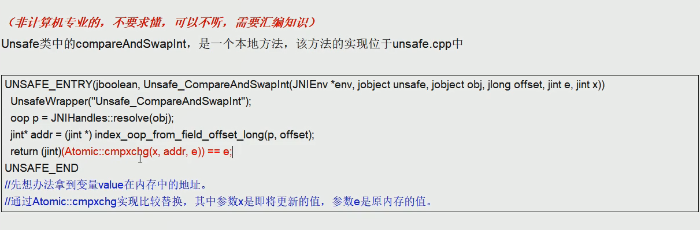

- 相比`synchronized`：
  
    - `synchronized`加锁，同一时间段只允许一个线程访问，一致性得到了保证，但并发性下降了。`cas`没有加锁，通过`do...while`完成(见[AtomicInteger](AtomicInteger.md))，没有加锁，可以反复比较，直到成功。

### 显式锁/`ReentrantLock`

- `java.util.concurrent.locks.Lock`接口，如下：

```java
public interface Lock{
	//获取锁,会阻塞一直到成功
	void lock();

	//与lock不同的是可以响应中断，如果被其他线程中断，则抛出InterruptedException
	void lockInterruptibly() throws InterruptedException;

	//尝试获取锁，立即返回，不阻塞。成功返回true,否则返回false
	boolean tryLock();

	boolean tryLock(long time, TimeUnit unit) throws InterruptedException;

	//释放锁
	void unlock();

	//新建一个条件
	Condition newCondition();
}
```

- 支持以非阻塞方式获取锁，可以响应中断，可以限时，相比`synchronized`更灵活。

- 主要实现类为可重入锁[ReentrantLock](ReentrantLock.md)

- 注意，使用`ReentrantLock`时，加锁几次就要解锁几次，如果对同一段代码块多次加锁解锁，只要加锁解锁次数对应，无影响，如果加锁次数大于解锁次数，程序就会一直在运行，

### synchronized与ReentrantLock区别 

1. 基本意义层面，`synchronized`是`java`关键字属于`jvm`层面，通过`monitorenter` `monitorexit`(底层通过`monitor`对象来完成，其实`wait/notify`等方法也依赖于`monitor`对象，只有在同步块或方法中才能调`wait/notify`)， `ReentrantLock`是具体的类，属`api`层面。
2. `synchronized`使用更简洁，不需要用户手动释放锁，当`synchronized`代码执行完后，系统会自动让线程释放对锁的占用，`ReentrantLock`则需要用户手动释放锁，若没有主动释放锁，可能导致死锁。
4. `synchronized`不可中断，触发抛异常或者正常运行完成。`ReentrantLock`可中断，

   1. 设置超时方法`tryLock(Long timeout,TimeUnit unit)`。
   2. `lockInterruptibly()`放代码中，调用`interrupt()`方法可中断。
4. `synchronized`非公平锁，`ReentrantLock`可公平可不公平。默认非公平锁。
5. 绑定多个条件`Condition`。`synchronized`没有，`ReentrantLock`用来实现分组唤醒需要唤醒的线程们，可以精确唤醒，而不是像`synchronized`要么随机唤醒一个，要么全部唤醒。
6. 1.6之后的版本中，`synchronized`和`ReentrantLock`性能差不多
8. `synchronized`和`ReentrantLock`都是阻塞式的同步锁，即一个线程获得对象锁，其他线程必须阻塞在同步块外等待。

- ```java
  /**
   * 题目（考察Reentrant的condition能精确唤醒线程，而不是像synchronized一样要么全唤醒，要么随机唤醒一个）：
   *      多个线程之间按顺序调用，实现A->B->C 3个线程启动，要求如下；
   *          AA打印1次，BB打印2次，CC打印3次
   *          紧接着
   *          AA打印1次，BB打印2次，CC打印3次
   *          3轮
   *  解法：
   *      1.线程 操作 资源类
   *      2.判断 干活 通知
   *      3.防止虚假唤醒(用while不用if)
   *
   *  result:
   *      A	0
   *      B	0
   *      B	1
   *      C	0
   *      C	1
   *      C	2
   *      A	0
   *      B	0
   *      B	1
   *      C	0
   *      C	1
   *      C	2
   *      A	0
   *      B	0
   *      B	1
   *      C	0
   *      C	1
   *      C	2
   */
  class ShareResource{
      private int number = 1;
      private Lock lock = new ReentrantLock();
  
      private Condition c1 = lock.newCondition();
      private Condition c2 = lock.newCondition();
      private Condition c3 = lock.newCondition();
  
      public void print1(){
          lock.lock();
          try {
              //1.判断
              while (number != 1){
                  c1.await();
              }
              //2.干活
              for (int i = 0; i < 1; i++) {
                  System.out.println(Thread.currentThread().getName()+"\t"+i);
              }
              //3.通知（修改标志位，通知c2）
              number = 2;
              c2.signal();
          } catch (Exception e) {
              e.printStackTrace();
          } finally {
              lock.unlock();
          }
      }
  
      public void print2(){
          lock.lock();
          try {
              //1.判断
              while (number != 2){
                  c2.await();
              }
              //2.干活
              for (int i = 0; i < 2; i++) {
                  System.out.println(Thread.currentThread().getName()+"\t"+i);
              }
              //3.通知（修改标志位，通知c3）
              number = 3;
              c3.signal();
          } catch (Exception e) {
              e.printStackTrace();
          } finally {
              lock.unlock();
          }
      }
  
      public void print3(){
          lock.lock();
          try {
              //1.判断
              while (number != 3){
                  c3.await();
              }
              //2.干活
              for (int i = 0; i < 3; i++) {
                  System.out.println(Thread.currentThread().getName()+"\t"+i);
              }
              //3.通知（修改标志位，通知c1）
              number = 1;
              c1.signal();
          } catch (Exception e) {
              e.printStackTrace();
          } finally {
              lock.unlock();
          }
      }
  }
  public class SyncAndReentrantLockDemo {
      public static void main(String[] args) {
          ShareResource shareResource = new ShareResource();
          new Thread(()->{
              for (int i = 0; i < 3; i++) {
                  shareResource.print1();
              }
          },"A").start();
          new Thread(()->{
              for (int i = 0; i < 3; i++) {
                  shareResource.print2();
              }
          },"B").start();
          new Thread(()->{
              for (int i = 0; i < 3; i++) {
                  shareResource.print3();
              }
          },"C").start();
      }
  }
  ```

- 

### 显式条件

[Condition](ReentrantLock.md)

### 阻塞队列

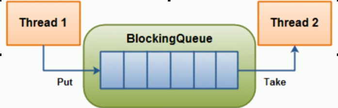

- 阻塞队列,顾名思义,首先它是一个队列。`thread1`往阻塞队列中添加元素，`thread2`从队列中移除元素，**当阻塞队列是空时,从队列中获取元素的操作将会被阻塞；当阻塞队列是满时,往队列中添加元素的操作将会被阻塞。**

- `BlockingQueue`继承架构

  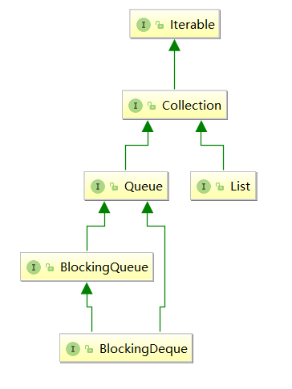

  ​		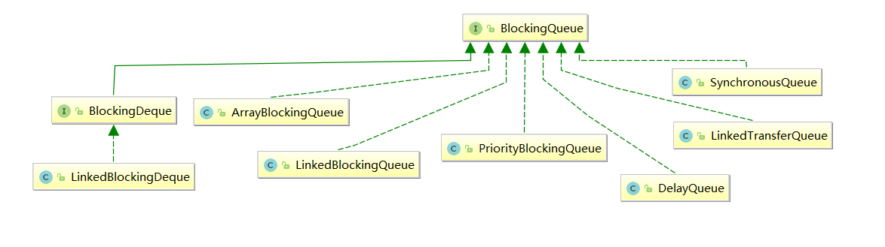

  - 主要有`7`个实现类

    - **`ArrayBlockQueue`：由数组组成的有界阻塞队列。**
    - **`LinkedBlockingQueue`：由链表组成的有界(默认界为`Integer.MAX_VALUE`)阻塞队列。**
    - `PriorityBlockingQueue`：支持优先级排序的无界阻塞队列。
    - `DelayQueue`：使用优先级队列实现的延迟无界阻塞队列。
    - **`SynchronousQueue`：不存储元素的阻塞队列，也即单个元素的队列。**
    - `LinkedTransferQueue`：由链表组成的无界阻塞队列。
    - `LinkedBlockDeque`：由链表组成的双向阻塞队列。

  - `ArrayBlockQueue`  `API`

    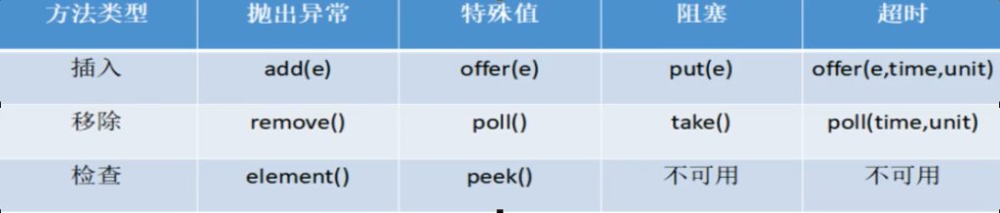

    | 抛出异常   | 当阻塞队列满时,再往队列里面`add`插入元素会抛`IllegalStateException: Queue full`<br>当阻塞队列空时,再往队列`Remove`元素时候回抛出`NoSuchElementException` |
    | ---------- | ------------------------------------------------------------ |
    | **特殊值** | **插入方法,成功返回`true `失败返回false<br/>移除方法,成功返回元素,队列里面没有就返回`null`** |
    | **阻塞**   | **当阻塞队列满时,生产者继续往队列里面`put`元素,队列会一直阻塞直到`put`数据`or`响应中断退出<br/>当阻塞队列空时,消费者试图从队列`take`元素,队列会一直阻塞消费者线程直到队列可用.** |
    | **超时**   | **当阻塞队列满时,队列会阻塞生产者线程一定时间,超过后限时后生产者线程就会退出** |

    

    ```java
    public class BlockingQueueDemo {
        public static void main(String[] args) throws InterruptedException {
            //throwExceptionAPI();
            //specialValAPI();
            //blockingAPI();
            //timeOutAPI();
        }
        private static void throwExceptionAPI() {
            BlockingQueue<String> blockingQueue = new ArrayBlockingQueue<>(3);
            blockingQueue.add("a");
            blockingQueue.add("b");
            blockingQueue.add("c");
            //初始容量为3，添加a,b,c后就满了，再添加会报IllegalStateException: Queue full
            //blockingQueue.add("d");
    
            blockingQueue.remove();
            blockingQueue.remove();
            blockingQueue.remove();
            //总共只有3个，再取就报异常NoSuchElementException
            //blockingQueue.remove();
        }
        private static void specialValAPI() {
            BlockingQueue<String> blockingQueue = new ArrayBlockingQueue<>(3);
            System.out.println(blockingQueue.offer("a"));
            System.out.println(blockingQueue.offer("b"));
            System.out.println(blockingQueue.offer("c"));
            //初始容量为3，添加a,b,c后就满了，再添加会返回false
            //System.out.println(blockingQueue.offer("d"));
    
            System.out.println(blockingQueue.poll());
            System.out.println(blockingQueue.poll());
            System.out.println(blockingQueue.poll());
            //总共只有3个，再取就返回null
            //System.out.println(blockingQueue.poll());
        }
        private static void blockingAPI() throws InterruptedException {
            BlockingQueue<String> blockingQueue = new ArrayBlockingQueue<>(3);
            blockingQueue.put("a");
            blockingQueue.put("b");
            blockingQueue.put("c");
            //初始容量为3，添加a,b,c后就满了，再添加会一直阻塞
            //blockingQueue.put("d");
    
            System.out.println(blockingQueue.take());
            System.out.println(blockingQueue.take());
            System.out.println(blockingQueue.take());
            //总共只有3个，再取就返回会进入阻塞
            //System.out.println(blockingQueue.take());
        }
        private static void timeOutAPI() throws InterruptedException {
            BlockingQueue<String> blockingQueue = new ArrayBlockingQueue<>(3);
    
            System.out.println(blockingQueue.offer("a",2L,TimeUnit.SECONDS));
            System.out.println(blockingQueue.offer("b",2L,TimeUnit.SECONDS));
            System.out.println(blockingQueue.offer("c",2L,TimeUnit.SECONDS));
            //初始容量为3，添加a,b,c后就满了，再添加就会阻塞2s，2s后依旧阻塞就返回false
            //System.out.println(blockingQueue.offer("d",2L,TimeUnit.SECONDS));
    
            System.out.println(blockingQueue.poll(2L,TimeUnit.SECONDS));
            System.out.println(blockingQueue.poll(2L,TimeUnit.SECONDS));
            System.out.println(blockingQueue.poll(2L,TimeUnit.SECONDS));
            //总共只有3个，再取就报异常阻塞2s，两秒后队列依旧为空就返回null
            //System.out.println(blockingQueue.poll(2L,TimeUnit.SECONDS));
        }
    }
    ```

  - `SynchronousQueue`  `API`

    ```java
    public class SynchronousQueueDemo {
        /**
         * result:
         *  AAA	put 1
         *  BBB	get 1
         *  AAA	put 2
         *  BBB	get 2
         *  AAA	put 3
         *  BBB	get 3
         */
        public static void main(String[] args) {
            BlockingQueue blockingQueue = new SynchronousQueue();
            new Thread(()->{
                try {
                    System.out.println(Thread.currentThread().getName() + "\tput 1");
                    blockingQueue.put("1");
                    System.out.println(Thread.currentThread().getName() + "\tput 2");
                    blockingQueue.put("2");
                    System.out.println(Thread.currentThread().getName() + "\tput 3");
                    blockingQueue.put("3");
                } catch (InterruptedException e) {
                    e.printStackTrace();
                }
            },"AAA").start();
    
            new Thread(()->{
                try {
                    //3s取一次，只有取完，上面的put才能成功
                    TimeUnit.SECONDS.sleep(3);
                    System.out.println(Thread.currentThread().getName() + "\tget "+blockingQueue.take());
                    TimeUnit.SECONDS.sleep(3);
                    System.out.println(Thread.currentThread().getName() + "\tget "+blockingQueue.take());
                    TimeUnit.SECONDS.sleep(3);
                    System.out.println(Thread.currentThread().getName() + "\tget "+blockingQueue.take());
                } catch (InterruptedException e) {
                    e.printStackTrace();
                }
            },"BBB").start();
        }
    }
    ```

### 生产者/消费者
#### `wait`/`notifyAll`/`synchronized`

```java
/**
 * result:
 * 生产者当前number:0生产者生产
 * 生产者当前number:1生产者阻塞
 * 消费者当前number:1消费者消费
 * 消费者当前number:0消费者阻塞
 * 生产者当前number:0生产者生产
 * 生产者当前number:1生产者阻塞
 * 消费者当前number:1消费者消费
 * 消费者当前number:0消费者阻塞
 * 生产者当前number:0生产者生产
 * 消费者当前number:1消费者消费
 */
class ShareData{
    public int number = 0;
    public void increment(){
        number ++;
    }
    public void decrement(){
        number --;
    }
}
public class ProdConsumer_Demo {
    public static void main(String[] args) {
        ShareData shareData = new ShareData();
        new Thread(()->{
            for (int i = 0; i < 5; i++) {
                synchronized (shareData){
                    if(shareData.number == 0){
                        //必须用notifyAll()，否则当有多个消费者、生产者时会出现假死
                        shareData.notifyAll();
                        System.out.println(Thread.currentThread().getName() + "当前number:" + shareData.number  + "生产者生产");
                        shareData.increment();
                    }else{
                        try {
                            System.out.println(Thread.currentThread().getName() + "当前number:" + shareData.number  + "生产者阻塞");
                            shareData.wait();
                        } catch (InterruptedException e) {
                            e.printStackTrace();
                        }
                    }
                }
            }
        },"生产者").start();

        new Thread(()->{
            for (int i = 0; i < 5; i++) {
                synchronized (shareData){
                    if(shareData.number == 1){
                        //必须用notifyAll()，否则当有多个消费者、生产者时会出现假死
                        shareData.notifyAll();
                        System.out.println(Thread.currentThread().getName() + "当前number:" + shareData.number  + "消费者消费");
                        shareData.decrement();
                    }else{
                        try {
                            System.out.println(Thread.currentThread().getName() + "当前number:" + shareData.number  + "消费者阻塞");
                            shareData.wait();
                        } catch (InterruptedException e) {
                            e.printStackTrace();
                        }
                    }
                }
            }
        },"消费者").start();
    }
}


```


#### `await`/`singalAll`/`ReentrantLock`

- ```java
  /**
   *  题目：一个初始值为零的变量，两个线程对其交替操作，一个加1，一个减1,5轮
   *  解法：
   *      1.线程 操作 资源类
   *      2.判断 干活 通知
   *      3.防止虚假唤醒
   *  注意：只能用while，不能用if(防止虚假唤醒)，如果用if，当用4个线程测试时就乱了
   *  
   *  result:
   *      AAA	1
   *       BBB	0
   *      AAA	1
   *      BBB	0
   *      AAA	1
   *      BBB	0
   *      CCC	1
   *      BBB	0
   *      CCC	1
   *      DDD	0
   *      CCC	1
   *      DDD	0
   *      CCC	1
   *      DDD	0
   *      CCC	1
   *      DDD	0
   *      AAA	1
   *      DDD	0
   */
  class ShareData{
      private int number = 0;
      private Lock lock = new ReentrantLock();
      private Condition condition = lock.newCondition();
      public void increment() throws InterruptedException {
          //加锁
          lock.lock();
          try {
              //1.判断，只能用while，不能用if
              if (number != 0){
                  //等待，不能生产（number为1不能再加）
                  condition.await();
              }
              number ++;
              System.out.println(Thread.currentThread().getName()+"\t"+number);
              condition.signalAll();
          } catch (Exception e) {
              e.printStackTrace();
          } finally {
              //解锁
              lock.unlock();
          }
      }
      public void decrement() throws InterruptedException {
          //加锁
          lock.lock();
          try {
              //1.判断，只能用while，不能用if
              if (number == 0){
                  //等待，不能生产（number为0不能再减）
                  condition.await();
              }
              number --;
              System.out.println(Thread.currentThread().getName()+"\t"+number);
              condition.signalAll();
          } catch (Exception e) {
              e.printStackTrace();
          } finally {
              //解锁
              lock.unlock();
          }
      }
  }
  public class ProdConsumer_TraditionDemo {
      public static void main(String[] args) {
          ShareData shareData = new ShareData();
          new Thread(()->{
              for (int i = 1; i < 5; i++) {
                  try {
                      shareData.increment();
                  } catch (InterruptedException e) {
                      e.printStackTrace();
                  }
              }
          },"AAA").start();
  
          new Thread(()->{
              for (int i = 1; i < 5; i++) {
                  try {
                      shareData.decrement();
                  } catch (InterruptedException e) {
                      e.printStackTrace();
                  }
              }
          },"BBB").start();
  
          new Thread(()->{
              for (int i = 0; i < 5; i++) {
                  try {
                      shareData.increment();
                  } catch (InterruptedException e) {
                      e.printStackTrace();
                  }
              }
          },"CCC").start();
  
          new Thread(()->{
              for (int i = 0; i < 5; i++) {
                  try {
                      shareData.decrement();
                  } catch (InterruptedException e) {
                      e.printStackTrace();
                  }
              }
          },"DDD").start();
      }
  }
  
  ```
#### 阻塞队列
- 用阻塞队列实现消费者、生产者模式。

- ```java
  /**
   * 
   * result:
   *      java.util.concurrent.ArrayBlockingQueue
   *      Prod生产线程启动
   *      Comsumer消费线程启动
   *      Prod	生产1成功
   *      Comsumer	消费1成功
   *      Prod	生产2成功
   *      Comsumer	消费2成功
   *      Prod	生产3成功
   *      Comsumer	消费3成功
   *      Prod	生产4成功
   *      Comsumer	消费4成功
   *      Prod	生产5成功
   *      Comsumer	消费5成功
   *      main线程叫停
   *      Prod	叫停，FLAG=false
   *      Comsumer	超过2s没有取到，消费退出
   */
  class MyResource{
      //标志位，是否进行生产和消费，默认进行
      private volatile boolean flag = true;
  
      private AtomicInteger atomicInteger = new AtomicInteger();
      //不能用具体的实现类，要用接口
      BlockingQueue<String> blockingQueue = null;
  
      public MyResource(BlockingQueue<String> blockingQueue) {
          this.blockingQueue = blockingQueue;
          System.out.println(blockingQueue.getClass().getName());
      }
  
      /**
       * 生产
       */
      public void myProd() throws InterruptedException {
          String data;
          boolean retValue;
          //标志位为false时不生产
          while (flag){
              data = atomicInteger.incrementAndGet()+"";
              retValue = blockingQueue.offer(data, 2, TimeUnit.SECONDS);
              if(retValue){
                  System.out.println(Thread.currentThread().getName()+"\t生产"+data+"成功");
              }else{
                  System.out.println(Thread.currentThread().getName()+"\t生产"+data+"失败");
              }
              TimeUnit.SECONDS.sleep(1);
          }
          System.out.println(Thread.currentThread().getName()+"\t叫停，FLAG=false");
      }
  
      /**
       * 消费
       */
      public void myConsumer() throws InterruptedException {
          String result = null;
          //标志位为false时不生产
          while (flag){
              result = blockingQueue.poll(2,TimeUnit.SECONDS);
              if(null == result || result.equalsIgnoreCase("")){
                  flag = false;
                  System.out.println(Thread.currentThread().getName()+"\t超过2s没有取到，消费退出");
                  return;
              }
              System.out.println(Thread.currentThread().getName()+"\t消费"+result+"成功");
          }
      }
      //停止生产和消费
      public void stop(){
          this.flag = false;
      }
  }
  public class ProdConsumer_BlockQueueDemo {
      public static void main(String[] args) {
          MyResource myResource = new MyResource(new ArrayBlockingQueue<String>(3));
          new Thread(()->{
              System.out.println(Thread.currentThread().getName()+"生产线程启动");
              try {
                  myResource.myProd();
              } catch (InterruptedException e) {
                  e.printStackTrace();
              }
          },"Prod").start();
  
          new Thread(()->{
              System.out.println(Thread.currentThread().getName()+"消费线程启动");
              try {
                  myResource.myConsumer();
              } catch (InterruptedException e) {
                  e.printStackTrace();
              }
          },"Comsumer").start();
  
          try {
              TimeUnit.SECONDS.sleep(5);
          } catch (InterruptedException e) {
              e.printStackTrace();
          }
  
          System.out.println("main线程叫停");
          myResource.stop();
      }
  }
  
  ```

- 

### 线程池

- 线程池主要工作：控制运行的线程的数量，处理过程中将任务放入队列，然后在线程创建后启动这些任务，如果线程数量超过了最大数量，超出数量的线程就排队等候。等其他线程执行完毕，再从队列中取出任务来执行。

- 主要特点：线程复用、控制最大并发数、管理线程

- 优点：

1. **降低资源消耗**。复用已创建的线程降低线程创建和销毁的消耗。
2. **提高响应速度**。任务到达时，不需要等到线程创建就能立即执行。
3. **提高线程可管理性**。线程池可以对线程进行统一的分配、调优、监控。

#### 线程池架构

- 

#### java获取线程池

1. **`Executors.newFixedThreadPool(int)`** (一池固定数线程)

   > 实现，`LinkedBlockingQueue`

   ```java
       public static ExecutorService newFixedThreadPool(int nThreads) {
           return new ThreadPoolExecutor(nThreads, nThreads,
                                         0L, TimeUnit.MILLISECONDS,
                                         new LinkedBlockingQueue<Runnable>());
       }
   ```

   > 代码实例

   ```java
   public class ThreadPoolDemo {
       /**
        * result
        *      pool-1-thread-2	办理业务
        *      pool-1-thread-1	办理业务
        *      pool-1-thread-2	办理业务
        *      pool-1-thread-1	办理业务
        *      pool-1-thread-2	办理业务
        */
       public static void main(String[] args) {
           //一池2线程，Executors.newFixedThreadPool(2)
           ExecutorService threadPool = newFixedThreadPool(2);
           try {
               for (int i = 0; i < 5; i++) {
                   threadPool.execute(()->{
                       System.out.println(Thread.currentThread().getName() + "\t办理业务");
                   });
               }
           }catch (Exception e){
               e.printStackTrace();
           }finally {
               threadPool.shutdown();
           }
       }
   }
   ```

   

2. **`Executors.newSingleThreadExecutor`** (一池一线程)

   > 实现，`LinkedBlockingQueue`

   ```java
       public static ExecutorService newSingleThreadExecutor() {
           return new FinalizableDelegatedExecutorService
               (new ThreadPoolExecutor(1, 1,
                                       0L, TimeUnit.MILLISECONDS,
                                       new LinkedBlockingQueue<Runnable>()));
       }
   ```

   > 代码实例

   ```java
   public class ThreadPoolDemo {
       /**
        * result
        *      pool-1-thread-1	办理业务
        *      pool-1-thread-1	办理业务
        *      pool-1-thread-1	办理业务
        */
       public static void main(String[] args) {
           //一池1线程，Executors.newSingleThreadExecutor()
           ExecutorService threadPool = newSingleThreadExecutor();
           try {
               for (int i = 0; i < 3; i++) {
                   threadPool.execute(()->{
                       System.out.println(Thread.currentThread().getName() + "\t办理业务");
                   });
               }
           }catch (Exception e){
               e.printStackTrace();
           }finally {
               threadPool.shutdown();
           }
       }
   }
   ```

   

   

3. **`Executors.newCachedThreadPool` ** (一池多线程)

   > 实现，`SynchronousQueue`

   ```java
       public static ExecutorService newCachedThreadPool() {
           return new ThreadPoolExecutor(0, Integer.MAX_VALUE,
                                         60L, TimeUnit.SECONDS,
                                         new SynchronousQueue<Runnable>());
       }
   ```

   > 代码实例

   ```java
   public class ThreadPoolDemo {
       /**
        * result1(注释TimeUnit.MILLISECONDS.sleep(200))：
        *      pool-1-thread-1	办理业务
        *      pool-1-thread-2	办理业务
        *      pool-1-thread-3	办理业务
        *      pool-1-thread-4	办理业务
        *      pool-1-thread-5	办理业务
        *
        * result2(不注释TimeUnit.MILLISECONDS.sleep(200))：
        *      pool-1-thread-1	办理业务
        *      pool-1-thread-1	办理业务
        *      pool-1-thread-1	办理业务
        *      pool-1-thread-1	办理业务
        *      pool-1-thread-1	办理业务
        */
       public static void main(String[] args) {
           //一池多线程，Executors.newCachedThreadPool()
           ExecutorService threadPool = newCachedThreadPool();
           try {
               for (int i = 0; i < 5; i++) {
                   threadPool.execute(()->{
                       System.out.println(Thread.currentThread().getName() + "\t办理业务");
                   });
                   TimeUnit.MILLISECONDS.sleep(200);
               }
           }catch (Exception e){
               e.printStackTrace();
           }finally {
               threadPool.shutdown();
           }
       }
   }
   ```

   

4. `Executors.newScheduledThreadPool`  (了解即可)

5. `Executors.newWorkStealingPool`  (`java8`新出，了解即可)

#### execute()与submit()

- `execute()`方法没有返回值，无法判断任务是否被线程池成功执行。
- `submit()`方法返回`Future`对象，可通过 `future` 的` get()` 方法来获取返回值

####  Executor/ExecutorService/Executors

- 关系图

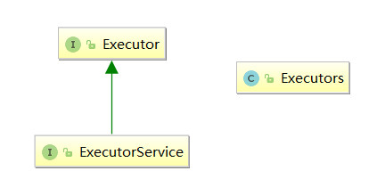

- `Executor` 是一个抽象层面的核心接口，只有一个`execute`方法。`execute()`方法无返回值
- `ExecutorService` 接口 对` Executor` 接口进行了扩展，提供了终止，关闭线程池等方法。提供`submit()`方法用来提交任务,`submit()`方法返回`Future`对象，可用来获取任务执行结果
- `Executors` 是一个工具类，类似于 `Collections`。提供工厂方法来创建不同类型的线程池

#### ThreadPoolExecutor

`ThreadPoolExecutor`构造方法，核心7个参数

```java
	public ThreadPoolExecutor(int corePoolSize,
                              int maximumPoolSize,
                              long keepAliveTime,
                              TimeUnit unit,
                              BlockingQueue<Runnable> workQueue,
                              ThreadFactory threadFactory,
                              RejectedExecutionHandler handler) {
        if (corePoolSize < 0 ||
            maximumPoolSize <= 0 ||
            maximumPoolSize < corePoolSize ||
            keepAliveTime < 0)
            throw new IllegalArgumentException();
        if (workQueue == null || threadFactory == null || handler == null)
            throw new NullPointerException();
        this.acc = System.getSecurityManager() == null ?
                null :
                AccessController.getContext();
        this.corePoolSize = corePoolSize;
        this.maximumPoolSize = maximumPoolSize;
        this.workQueue = workQueue;
        this.keepAliveTime = unit.toNanos(keepAliveTime);
        this.threadFactory = threadFactory;
        this.handler = handler;
    }
```

##### corePoolSize

- **线程池中的常驻核心线程数**。在创建了线程池后，当有请求任务来之后，就会安排池中的线程去执行请求任务。当线程池中的线程数目达到`corePoolSize`后，就会把到达的任务放到缓存队列当中。_类似银行的当值窗口。_

##### maximumPoolSize

- **线程池能够容纳同时执行的最大线程数**，此值必须>=1。_类似银行的所有业务窗口总数。_

##### keepAliveTime

- **多余的空闲线程的存活时间**。当前线程数量超过`corePoolSize`时，当空闲时间达到`keepAliveTime`值时，多余空闲线程会被销毁直到只剩下`corePoolSize`个线程为止。_类似银行客户爆满后，经过一段时间处理，用户数量减少，用户数量<当值窗口，除当值窗口之外的窗口为空闲状态，此时经过一定时间就会撤掉其他窗口_

##### unit

- **`keepAliveTime`的单位**。

##### workQueue

- **任务队列，被提交但尚未执行的任务**。_类似银行候客区。_

##### threadFactory

- **表示生成线程池中工作线程的线程工厂**，用于创建线程，一般用默认的即可。

##### handler

- **拒绝策略**。表示当`workQueue`满了并且工作线程>=线程池的`maximumPoolSize`时如何来拒绝请求执行的`runnable`的策略。_类似银行的所有窗口和候客区都爆满，此时再来客户就拒绝服务_

####  线程池5种状态

##### running

- 能够接收新任务，处理已添加的任务

##### shutdown

- 不接收新任务，能处理已添加的任务

##### stop

- 不接收新任务，不处理已添加的任务

##### tidying

- 所有任务终止了，`wrokCount`记录数为0，然后调用`terminated()`方法进入`terminated`状态

##### terminated

- 线程池彻底终止。

#### 线程池工作原理

- 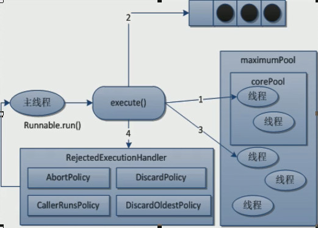


- 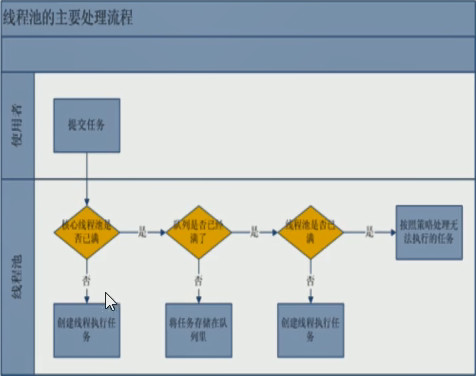

1. **在创建了线程池后，等待提交过来的任务请求。**
2. **当调用`execute()`方法添加一个请求任务时，线程池会做如下判断。**
   1. **如果正在运行的线程数量小于`corePoolSize`，那么马上会创建线程运行这个任务。**
   2. **如果正在运行的线程数量等于`corePoolSize`，那么将这个任务放入`workQueue`**
   3. **如果这时候队列满了且正在运行的线程数量小于`maximumPoolSize`，那么创建非核心线程立即运行这个任务**。
   4. **如果队列满了且正在运行的线程数量>=`maximumPoolSize`，那么线程池会启动饱和拒绝策略来执行**。
3. **当一个线程完成任务时，它会从队列中去取另一个任务来执行**。
4. **当一个线程空闲且超过一定时间(`keepAliveTime`)时，线程池会判断**：
   1. **如果当前运行的线程数>`corePoolSize`，那么这个线程就被停掉了**。
   2. **所有线程池的所有任务完成以后，它最终会收缩到`corePoolSize`大小**。

##### 拒绝策略

- `AbortPolicy`(默认)：直接抛出`RejectedExecutionException`异常阻止系统正常运行。
- `CallerRunsPolicy`：调用者运行一种调节机制，该机制既不会抛弃任务，也不会抛出异常，而是将某些任务回退给调用者，从而降低新任务流量。比如`main`线程中启动其它线程，那么可能将任务回退给`main`线程。
- `DiscardOldestPolicy`：抛弃队列中等待最久的任务，然后把当前任务加入队列中，尝试再次提交当前任务。
- `DiscardPolicy`：直接丢弃任务，不予任何处理也不跑异常，如果允许任务丢失，这是最好的方案。

#### 生产实际

- `FixedThreadPool`和`SingleThreadPool`的`workQueue`参数为`LinkedBlockingQueue`，默认长度为` Integer.MAX_VALUE`，可能会堆积大量的请求，从而导致 OOM。

- `CachedThreadPool`  的`maximumPoolSize`参数为` Integer.MAX_VALUE`，可能会创建大量的线程，从而导致 OOM。 所以：**实际业务中，不使用jdk自带的3种创建线程池方式，而是自定义创建线程池，需要合理配置7个参数。**


```java
public class MyThreadPoolDemo {
    /**
     * 当任务数 > maximumPoolSize + 阻塞队列大小 时，就会触发拒绝策略
     * 此时任务数为for循环次数
     */
    public static void main(String[] args) {
        //自定义线程池，7个参数
        ExecutorService threadPool = new ThreadPoolExecutor(
                2,
                5,
                1L,
                TimeUnit.SECONDS,
                new LinkedBlockingQueue<>(3),
                Executors.defaultThreadFactory(),
                new ThreadPoolExecutor.AbortPolicy());
        try {
            //模拟任务数
            for (int i = 0; i < 9; i++) {
                threadPool.execute(() -> {
                    System.out.println(Thread.currentThread().getName()+"办理");
                });
            }
        } catch (Exception e) {
            e.printStackTrace();
        } finally {
            threadPool.shutdown();
        }
    }
}
```

- 设置`maximumPoolSize`时，先判断业务是`cpu`密集型还是`io`密集型。
  1. `Runtime.getRuntime().availableProcessors()`获取`cpu`核数。
     1. `CPU`密集型
       - 即该任务需要大量运算而没有阻塞，`CPU`一直全速运行。一般公式：`cpu核数+1` 个线程
     2. `IO`密集型
       - `IO`密集型任务线程不是一直在执行任务，应该配置尽可能多的线程，配置`cpu核数*2`个线程
       - 任务需要大量IO，即大量阻塞，参考公式：`cpu核数/1-阻塞系数`，阻塞系数在`0.8-0.9`之间。比如`8`核`cpu`：`8/(1-0.9)=80`个线程数。

### java.lang.ThreadLocal

- `ThreadLocal`是用来提供线程局部变量的，在线程内可以随时随地的存取数据，而且线程之间互不干扰。
- [ThreadLocal](ThreadLocal.md)

### AQS

#### AQS原理

- AQS是一个用来构建锁和同步器的框架，使用AQS能简单高效的构造出大量的同步器，比如`ReentrantLock`，`ReentrantLockReadWriteLock`等待。

- **AQS 核心思想是，如果被请求的共享资源空闲，则将当前请求资源的线程设置为有效的工作线程，并且将共享资源设置为锁定状态。如果被请求的共享资源被占用，那么就需要一套线程阻塞等待以及被唤醒时锁分配的机制，这个机制 AQS 是用 CLH 队列锁实现的，即将暂时获取不到锁的线程加入到队列中。**

- CLH(Craig,Landin,and Hagersten) 队列是一个虚拟的双向队列（虚拟的双向队列即不存在队列实例，仅存在结点之间的关联关系）。AQS 是将每条请求共享资源的线程封装成一个 CLH 锁队列的一个结点（Node）来实现锁的分配。

  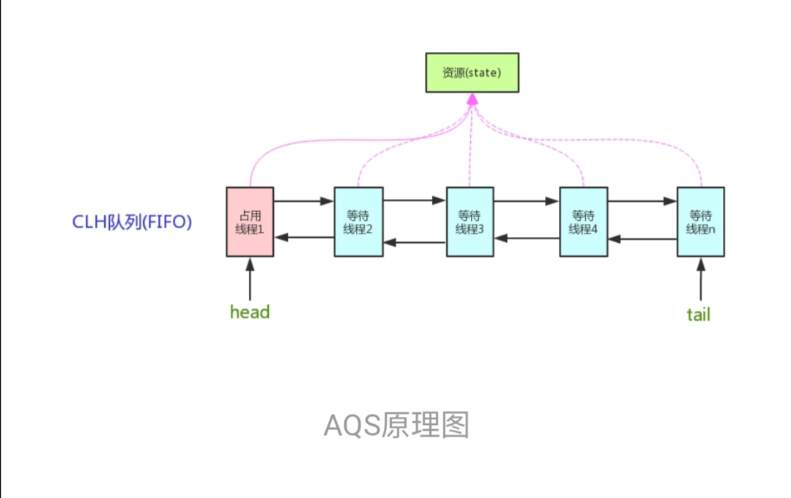

- AQS 使用一个 int 成员变量来表示同步状态，通过内置的 FIFO 队列来完成获取资源线程的排队工作。AQS 使用 CAS 对该同步状态进行原子操作实现对其值的修改。

  `private volatile int state;//共享变量，使用 volatile 修饰保证线程可见性`

- 状态信息通过 `protected` 类型的 `getState，setState，compareAndSetState `进行操作

  ```java
  //返回同步状态的当前值
  protected final int getState() {  
          return state;
  }
   // 设置同步状态的值
  protected final void setState(int newState) { 
          state = newState;
  }
  //原子地（CAS 操作）将同步状态值设置为给定值 update 如果当前同步状态的值等于 expect（期望值）
  protected final boolean compareAndSetState(int expect, int update) {
          return unsafe.compareAndSwapInt(this, stateOffset, expect, update);
  }
  ```

#### AQS对资源的共享方式

- 两种资源共享方式
  - **Exclusive**（独占）：只有一个线程能执行，如 ReentrantLock。又可分为公平锁和非公平锁：
    - 公平锁：按照线程在队列中的排队顺序，先到者先拿到锁
    - 非公平锁：当线程要获取锁时，无视队列顺序直接去抢锁，谁抢到就是谁的
  - **Share**（共享）：多个线程可同时执行，如 Semaphore/CountDownLatch。
- ReentrantReadWriteLock 可以看成是组合式，因为 ReentrantReadWriteLock 也就是读写锁允许多个线程同时对某一资源进行读。

- 不同的自定义同步器争用共享资源的方式也不同。自定义同步器在实现时只需要实现共享资源 state 的获取与释放方式即可，至于具体线程等待队列的维护（如获取资源失败入队/唤醒出队等），AQS 已经在顶层实现好了。

#### AQS模板方法模式

- 同步器的设计是基于模板方法模式的，如果需要自定义同步器一般的方式是这样（模板方法模式很经典的一个应用）：

1. 使用者继承 AbstractQueuedSynchronizer 并重写指定的方法。（这些重写方法很简单，无非是对于共享资源 state 的获取和释放）
2. 将 AQS 组合在自定义同步组件的实现中，并调用其模板方法，而这些模板方法会调用使用者重写的方法。

- 这和我们以往通过实现接口的方式有很大区别，这是模板方法模式很经典的一个运用。

- AQS 使用了模板方法模式，自定义同步器时需要重写下面几个 AQS 提供的模板方法

  ```java
  isHeldExclusively()//该线程是否正在独占资源。只有用到 condition 才需要去实现它。
      
  tryAcquire(int)//独占方式。尝试获取资源，成功则返回 true，失败则返回 false。
      
  tryRelease(int)//独占方式。尝试释放资源，成功则返回 true，失败则返回 false。
      
  tryAcquireShared(int)//共享方式。尝试获取资源。负数表示失败；0 表示成功，但没有剩余可用资源；正数表示成功，且有剩余资源。
      
  tryReleaseShared(int)//共享方式。尝试释放资源，成功则返回 true，失败则返回 false。
  ```

  - 默认情况下，每个方法都抛出 `UnsupportedOperationException`。 这些方法的实现必须是内部线程安全的，并且通常应该简短而不是阻塞。AQS 类中的其他方法都是 final ，所以无法被其他类使用，只有这几个方法可以被其他类使用。

  - 以 ReentrantLock 为例，state 初始化为 0，表示未锁定状态。A 线程 lock() 时，会调用 tryAcquire() 独占该锁并将 state+1。此后，其他线程再 tryAcquire() 时就会失败，直到 A 线程 unlock() 到 state=0（即释放锁）为止，其它线程才有机会获取该锁。当然，释放锁之前，A 线程自己是可以重复获取此锁的（state 会累加），这就是可重入的概念。但要注意，获取多少次就要释放多么次，这样才能保证 state 是能回到零态的。

  - 再以 CountDownLatch 以例，任务分为 N 个子线程去执行，state 也初始化为 N（注意 N 要与线程个数一致）。这 N 个子线程是并行执行的，每个子线程执行完后 countDown() 一次，state 会 CAS(Compare and Swap) 减 1。等到所有子线程都执行完后 (即 state=0)，会 unpark() 主调用线程，然后主调用线程就会从 await() 函数返回，继续后余动作。

  - 一般来说，自定义同步器要么是独占方法，要么是共享方式，他们也只需实现`tryAcquire-tryRelease`、`tryAcquireShared-tryReleaseShared`中的一种即可。但 AQS 也支持自定义同步器同时实现独占和共享两种方式，如`ReentrantReadWriteLock`。


