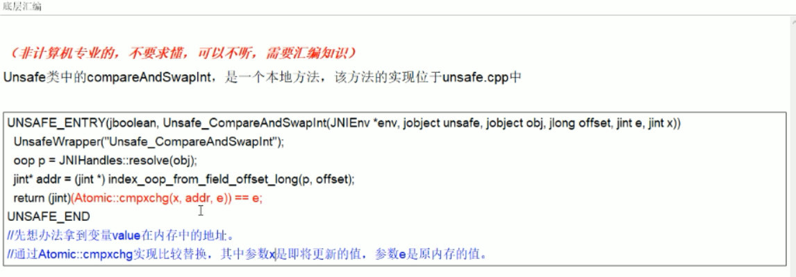

[TOC]

## 并发基础

### 线程基本概念

#### 创建线程

- 线程表示一条单独的执行流，它有自己的程序执行计数器，有自己的栈。在`java`中创建线程方式：
  1. 继承`Thread`类；
  2. 实现`Runnable`接口;
  3. 实现`Callable`接口
  4. 线程池

#### 线程基本属性和方法

- 状态

1. `new`：没有调用`start`的线程状态
2. `terminated`：线程运行结束后的状态
3. `runnable`：调用`start`后在执行`run`方法且没有阻塞时的状态
4. `blocked`：线程在等待锁
5. `waiting`：等待某个条件
6. `timed_waiting`：超时

- daemon

  守护线程，为其他线程提供服务，不是不可或缺，被守护线程结束时，守护线程也会退出。

  注意：

  - `setDaemon(true)`必须在`start()`前设置，不能把正在运行的常规线程设置为守护线程。
  - 守护线程永远不会访问固定资源，比如文件、数据库，因为它虽说可能退出。

- sleep方法

  让当前线程睡眠指定时间，不会释放锁，会让出CPU进入**阻塞态**，**任何优先级线程**都能得到执行机会。如果被中断，会抛出`InterruptedException`。

- yield方法

  只能让**拥有相同优先级的线程**获取CPU的机会，不会释放锁，会让出CPU，进入**就绪态**，只需等待重新获取CPU执行时间。

- join

  `join`方法的主要作用就是同步，它可以使得线程之间的并行执行变为串行执行。在A线程中调用了B线程的`join()`方法时，表示只有当B线程执行完毕时，A线程才能继续执行。

#### 共享内存及可能存在的问题

##### 竞态条件

线程的执行时序影响结果。

##### 内存可见性

在计算机系统中，数据可以写到内存、缓存、CPU寄存器，访问一个变量时，可能直接从缓存或寄存器中取，而不一定从内存取，修改一个变量时，也可能先写到缓存，稍后才会同步更新到内存中。多线程环境下，一个线程对内存的修改，可能没及时同步到内存，别的线程也可能没从内存读，所以导致别的线程看不到它的修改。

解决方案：`volatile`；`synchronized`；显式锁

##### 线程优点

- 充分利用多CPU的计算能力及硬件资源
- 用户界面程序或服务器应用程序中可以提升用户体验
- 创建、调度、切换需要消耗资源

### java内存模型(JMM)

​		JMM本身是一种抽象的概念并不真实存在，它描述的是组规范，通过组规范定义了程序中各个变量的访问方式。

​		JMM规定所有的变量都存储在主内存中，每个线程还有自己的工作内存，线程的工作内存中保存了被该线程使用到的变量的主内存副本拷贝。线程对变量的所有操作需在工作内存中进行，不能直接读写主内存中的变量。不同线程之间也不能直接互相访问工作内存中的变量。

​		JMM对于同步的规定：

1. 线程解锁前，必须把共享变量的值刷新回主内存。

2. 线程加锁前，必须读取主内存的最新值到自己的工作内存。

3. 加锁解锁是同一把锁。

   主内存与工作内存之间具体的交互协议，JMM定义了8种操作来完成，每种操作都是原子的：

   |        | 工作内存                                     | 主内存                                                       |
   | ------ | :------------------------------------------- | :----------------------------------------------------------- |
   | lock·  |                                              | 把一个变量标识为一条线程独占的状态                           |
   | unlock |                                              | 把一个处于锁定状态的变量释放出来，释放后的变量才可以被其他线程锁定 |
   | read   |                                              | 把一个变量的值从主内存传输到工作内存                         |
   | load   | 把read操作得到的值放入工作内存变量副本中     |                                                              |
   | use    | 把工作内存中一个变量值传递给执行引擎         |                                                              |
   | assign | 把一个从执行引擎接收到的值赋给工作内存的变量 |                                                              |
   | store  | 把工作内存中一个变量的值传输到主内存中       |                                                              |
   | write  |                                              | 把store操作从工作内存中得到的变量值放入主内存变量中          |

### volatile

​	volatile是java虚拟机提供的最轻量级的同步机制

- 保证内存可见性

  当某一条线程修改了这个变量值，新值对于其他线程来说是立即可以得知的。

- 不保证原子性

- 禁止指令重排

  从硬件架构来讲，指令重排是CPU采用了允许将多条指令不按程序规定的顺序分开发送给各相应电路单元处理。计算机在执行程序时，为了提高性能，编译器和处理器常常会对指令做重排，单线程环境里面确保程序最终执行结果和代码顺序执行的结果一致。处理器在进行重排序时必须要考虑指令间的数据依赖性。多线程环境中线程交替执行，由于编译器优化重排的存在，两个线程中使用的变量能否保证一致性是无法确定的，结果无法预测。

  内存屏障(memory barrier)，又称内存栅栏，是一个CPU指令，两个作用：

  1. 保证特定操作的执行顺序
  2. 保证某些变量的内存可见性(利用该特性实现volatile的内存可见性)。

  由于编译器和处理器都能执行指令重排优化，如果在指令间插入一条memory barrier则会告诉编译器和CPU，不管什么指令都不能和这个memory barrier指令重排序，也就是说，通过插入内存屏障禁止在内存屏障前后的指令执行重排序。内存屏障另一个作用是强制刷新任何CPU中的缓存数据，因此任何CPU上的线程都能读取到这些数据的最新版本。

### synchronized

synchronized可修饰实例方法、静态方法、代码块

#### 修饰实例方法

```java
public class Counter extends Thread{
    private int count;
    //加了synchronized后，方法内的代码就变成了原子操作。
    public synchronized void incr(){
        count ++;
    }
    public synchronized int getCount(){
        return count;
    }
}
```

此时，synchronized保护的是**当前实例对象，即this，多个线程可以同时执行同一个synchronized实例方法，只要它们访问的对象不同即可**。比如：

```java
Counter counter1 = new Counter();
Counter counter2 = new Counter();
Thread t1 = new CounterThread(counter1);
Thread t2 = new CounterThread(counter2);
t1.start();
t2.start();
```

对于同一个`counter`对象，一个线程执行`incr()`方法，另一个线程执行`getCount()`方法，它们是不能同时执行的。

this对象有一个锁和一个等待队列，锁只能被一个线程持有，线程执行synchronized实例方法时，尝试获得锁，如果获得，继续下一步；如果不能获得，加入等待队列，阻塞并等待唤醒。

#### 修饰静态方法

```java
public class Counter {
    private static int count = 0;
    public static synchronized void incr(){
        count ++;
    }
    public static synchronized int getCount(){
        return count;
    }
}
```

此时，synchronized保护的是**类对象，即`Counter.class`，synchronized实例方法和synchronized静态方法保护的是不同对象，不同两个线程可以一个执行synchronized静态方法，另一个执行synchronized实例方法。**

#### 修饰代码块

如下：等价于上面的修饰实例方法

```java
public class Counter {
    private int count = 0;
    public void incr(){
        synchronized (this){
            count ++;
        }
    }
    public int getCount(){
        synchronized(this){
            return count;
        }
    }
}

```


如下：等价于上面的修饰静态方法

```java
public class Counter {
    private static int count;
    public static void incr(){
        synchronized (Counter.class){
            count ++;
        }
    }
    public static int getCount(){
        synchronized(Counter.class){
            return count;
        }
    }
}

```

synchronized几个特性

- 可重入性(可重入锁也叫递归锁)

  synchronized是可重入的，即**对同一个执行线程，它在获得了锁之后，在调用其他需要同样锁的代码时，可以直接调用**。线程可以进入任何一个它已经拥有的锁所同步着的代码块。比如在一个synchronized实例方法内，可以直接调用其他synchronized实例方法。

  可重入是通过**记录锁的持有线程和持有数量来实现的**，当调用被synchronized保护的代码时，检查对象是否已经被锁，如果是，再检查是否被当前线程锁定，如果是，增加持有数量，如果不是被当前线程锁定，才加入等待队列，当释放锁时，减少持有数量，当数量变为0时才释放整个锁。

- 内存可见性

  **synchronized除了保证原子操作外，还可以保证内存可见性，在释放锁时，所有写入都会写回内存，获得锁后，都会从内存中读最新数据。**

- 死锁

  线程a持有锁A，等待锁B；线程b持有锁B,等待锁A。a、b陷入互相等待，谁都执行不下去。

  解决方案：改用显式锁或使用死锁检测工具`jstack`、`jps`等

##### wait/notify

​		除了用于锁的等待队列，每个对象还有一个条件队列，用于线程间的协作。`wait`会把当前线程放到条件队列上并阻塞，它需要等待一个条件，这个条件需要其他线程改变；`notify`就是从条件队列中选一个线程，将其从队列中移除并唤醒。`wait`执行过程：

1. 当前线程放入条件等待队列，释放对象锁，阻塞等待，线程状态变为`waiting`或`timed_waiting`
2. 等待时间到或被其他线程调用`notify/notifyAll`从条件队列移除，这是重新竞争对象锁：
   1. 如果能够获得对象锁：线程转态变为`runnable`，并从`wait`调用中返回。
   2. 否则，进入对象锁的等待队列，线程状态变为`blocked`，获得锁后才会从`wait`调用中返回。

### CountDownLatch

**让一些线程阻塞直到另一些线程完成一系列操作后才被唤醒。**

主要有两个方法，当一个或多个线程调用`await`方法时，调用线程会被阻塞。其他线程调用`countDown`方法会将计数器减1(调用`countDown`方法的线程不会阻塞)，当计数器的值变为0时，因调用`await`方法被阻塞的线程会被唤醒，继续执行。

### CyclicBarrier

让一组线程到达一个屏障(或者叫同步点)时被阻塞，直到最后一个线程到达屏障是，屏障才会开门，所有被屏障拦截的线程才会继续干活，线程进入屏障通过`CyclicBarrier`的`await`方法。

### Semaphore

信号量主要用于两个目的，一个是用于多个共享资源的互斥使用，另一个用于并发线程数的控制。

### 中断

​		停止一个线程的主要机制是中断，中断并不是强迫终止一个线程，它是一种协作机制，是给线程传递一个取消信号，但是由线程来决定如何以及何时退出。	

​		`Thread`类中定义的中断方法：

- `isInterrupted`：返回对应线程中断标志位是否为`true`。
- `interrupted`：返回对应线程中断标志位是否为`true`，并清空中断标志位(即如果连续两次调用，第1次为`true`，第2次就为`false`，除非同时又发生一次中断)。
- `interrupt`：中断对应线程。

## 并发包基础

### 自旋锁

指尝试获取锁的线程不会立即阻塞，而是采用循环的方式去尝试获取锁。

好处：减少线程上下文切换的消耗

缺点：循环会消耗CPU。

### 独占锁/共享锁

独占锁：该锁一次只能被一个线程持有。`ReentrantLock`和`Synchronized`都是独占锁。

共享锁：该锁可被多个线程所持有。

`ReentrantReadWriteLock`读锁是共享锁，写锁是独占锁。


### 原子变量和CAS

原子变量：包含一些以原子方式实现组合操作的方法。比如[AtomicInteger](AtomicInteger.md)

CAS：`public final boolean compareAndSet(int expect,int update)`方法的简称。是一条CPU并发原语。如果内存某个位置值等于`expect`，就更新为`update`,否则不更新，这个过程是原子的。

cas缺点：

1. 多次检测，如果一直有冲突，则开销很大。

2. 对多个共享变量操作时，无法保证操作的原子性，只能保证一个。

3. ABA问题。`CAS`算法实现一个重要前提需要取出内存中某时刻的数据并在当下时刻比较并替换，在这个时间差内数据可能发生变化。

   比如内存地址V初次读取的值为A,准备赋值时，检查它的值仍为A,但在这段时间内，它的值可能发生过变化。java并发包提供`AtomicStampedReference`类解决这个问题。在修改值的同时附加一个时间戳，只有值和时间戳都相同才进行修改。

原理：

1. 自旋锁

2. `Unsafe`类

   `Unsafe`类是`CAS`的核心类，`Unsafe`类存在于`sun.misc`包中，`Unsafe`类中的所有方法都是`native`修饰的，内部方法可以像c的指针一样操作内存。`CAS`的执行依赖`Unsafe`类的方法。

汇编原理：

在`unsafe.cpp`中有一个`Atomic::cmpxchg`指令。

<div align="center">  </div><br>
相比`synchronized`：

​		`synchronized`加锁，同一时间段只允许一个线程访问，一致性得到了保证，但并发性下降了。`cas`没有加锁，通过`do...while`完成(见[AtomicInteger](AtomicInteger.md))，没有加锁，可以反复比较，直到成功。

### 显式锁

`java.util.concurrent.locks.Lock`接口，如下：

```java
//获取锁,会阻塞一直到成功
void lock();

//与lock不同的是可以响应中断，如果被其他线程中断，则抛出InterruptedException
void lockInterruptibly() throws InterruptedException;

//尝试获取锁，立即返回，不阻塞。成功返回true,否则返回false
boolean tryLock();

boolean tryLock(long time, TimeUnit unit) throws InterruptedException;

//释放锁
void unlock();

//新建一个条件
Condition newCondition();
```

支持以非阻塞方式获取锁，可以响应中断，可以限时，相比synchronized更灵活。

主要实现类为可重入锁[ReentrantLock](ReentrantLock.md)

注意，使用`ReentrantLock`时，加锁几次就要解锁几次，如果对同一段代码块多次加锁解锁，只要加锁解锁次数对应，无影响，如果加锁次数大于解锁次数，程序就会一直在运行，

### synchronized与ReentrantLock区别 

1. `synchronized`代表一种声明式思维，程序员表达一种同步声明，由java系统负责实现。

   `ReentrantLock`代表一种命令式思维，由程序员实现细节。

2. 基本意义层面，`synchronized`是java关键字属于`jvm`层面，`monitorenter` `monitorexit`(底层通过`monitor`对象来完成，其实`wait/notify`等方法也依赖与`monitor`对象，只有在同步块或方法中才能调`wait/notify`)， `ReentrantLock`是具体的类，属api层面。

3. `synchronized`使用更简洁，不需要用户手动释放锁，当`synchronized`代码执行完后，系统会自动让线程释放对锁的占用，`ReentrantLock`则需要用户手动释放锁，若没有主动释放锁，可能导致死锁。

4. `synchronized`不可中断，触发抛异常或者正常运行完成。`ReentrantLock`可中断，

   1. 设置超时方法`tryLock(Long timeout,TimeUnit unit)`。
   2. `lockInterruptibly()`放代码中，调用`interrupt()`方法可中断。

5. `synchronized`非公平锁，`ReentrantLock`可公平可不公平。默认非公平锁。

6. 绑定多个条件`Condition`。`synchronized`没有，`ReentrantLock`用来实现分组唤醒需要唤醒的线程们，可以精确唤醒，而不是像`synchronized`要么随机唤醒一个，要么全部唤醒。

7. 1.6之后的版本中，`synchronized`和`ReentrantLock`性能差不多

8. `synchronized`和`ReentrantLock`都是阻塞式的同步锁，即一个线程获得对象锁，其他线程必须阻塞在同步块外等待。

### 显式条件

[Condition](ReentrantLock.md)

### 线程池

​		线程池主要工作：控制运行的线程的数量，处理过程中将任务放入队列，然后在线程创建后启动这些任务，如果线程数量超过了最大数量，超出数量的线程就排队等候。等其他线程执行完毕，再从队列中取出任务来执行。

​		主要特点：线程复用、控制最大并发数、管理线程

​		优点：

			1. 降低资源消耗。复用已创建的线程降低线程创建和销毁的消耗。
   			2. 提高响应速度。任务到达时，不需要等到线程创建就能立即执行。
   			3. 提高线程可管理性。线程池可以对线程进行统一的分配、调优、监控。

#### java获取线程池

1. `Executors.newFixedThreadPool(int)` (一池固定个数线程)

   ```java
       public static ExecutorService newFixedThreadPool(int nThreads) {
           return new ThreadPoolExecutor(nThreads, nThreads,
                                         0L, TimeUnit.MILLISECONDS,
                                         new LinkedBlockingQueue<Runnable>());
       }
   ```

   

2. `Executors.newSingleThreadExecutor` (一池一个线程)

   ```java
       public static ExecutorService newSingleThreadExecutor() {
           return new FinalizableDelegatedExecutorService
               (new ThreadPoolExecutor(1, 1,
                                       0L, TimeUnit.MILLISECONDS,
                                       new LinkedBlockingQueue<Runnable>()));
       }
   ```

   

3. `Executors.newCachedThreadPool` (一池多个线程)

   ```java
       public static ExecutorService newCachedThreadPool() {
           return new ThreadPoolExecutor(0, Integer.MAX_VALUE,
                                         60L, TimeUnit.SECONDS,
                                         new SynchronousQueue<Runnable>());
       }
   ```

   

4. `Executors.newScheduledThreadPool`  (了解即可)

5. `Executors.newWorkStealingPool`  (`java8`新出，了解即可)

#### ThreadPoolExecutor

`ThreadPoolExecutor`构造方法，核心7个参数

```java
	public ThreadPoolExecutor(int corePoolSize,
                              int maximumPoolSize,
                              long keepAliveTime,
                              TimeUnit unit,
                              BlockingQueue<Runnable> workQueue,
                              ThreadFactory threadFactory,
                              RejectedExecutionHandler handler) {
        if (corePoolSize < 0 ||
            maximumPoolSize <= 0 ||
            maximumPoolSize < corePoolSize ||
            keepAliveTime < 0)
            throw new IllegalArgumentException();
        if (workQueue == null || threadFactory == null || handler == null)
            throw new NullPointerException();
        this.acc = System.getSecurityManager() == null ?
                null :
                AccessController.getContext();
        this.corePoolSize = corePoolSize;
        this.maximumPoolSize = maximumPoolSize;
        this.workQueue = workQueue;
        this.keepAliveTime = unit.toNanos(keepAliveTime);
        this.threadFactory = threadFactory;
        this.handler = handler;
    }
```

##### corePoolSize

​		线程池中的常驻核心线程数。在创建了线程池后，当有请求任务来之后，就会安排池中的线程去执行请求任务。当线程池中的线程数目达到`corePoolSize`后，就会把到达的任务放到缓存队列当中。_类似银行的当值窗口。_

##### maximumPoolSize

​		线程池能够容纳同时执行的最大线程数，此值必须>=1。_类似银行的所有业务窗口总数。_

##### keepAliveTime

​		多余的空闲线程的存活时间。当前线程数量超过`corePoolSize`时，当空闲时间达到`keepAliveTime`值时，多余空闲线程会被销毁直到只剩下`corePoolSize`个线程为止。_类似银行客户爆满后，经过一段时间处理，用户数量减少，用户数量<当值窗口，除当值窗口之外的窗口为空闲状态，此时经过一定时间就会撤掉其他窗口_

##### unit

​		`keepAliveTime`的单位。

##### workQueue

​		任务队列，被提交但尚未执行的任务。_类似银行候客区。_

##### threadFactory

​		表示生成线程池中工作线程的线程工厂，用于创建线程，一般用默认的即可。

##### handler

​		拒绝策略，表示当`workQueue`满了并且工作线程>=线程池的`maximumPoolSize`时如何来拒绝请求执行的`runnable`的策略。_类似银行的所有窗口和候客区都爆满，此时再来客户就拒绝服务_

#### 线程池工作原理


<div align="center">  </div><br>
<div align="center">  </div><br>


1. 在创建了线程池后，等待提交过来的任务请求。

2. 当调用`execute()`方法添加一个请求任务是，线程池会做如下判断。

   1. 如果正在运行的线程数量小于`corePoolSize`，那么马上会创建线程运行这个任务。
   2. 如果正在运行的线程数量等于`corePoolSize`，那么将这个任务放入`workQueue`
   3. 如果这时候队列满了且正在运行的线程数量小于`maximumPoolSize`，那么创建非核心线程立即运行这个任务。
   4. 如果队列满了且正在运行的线程数量>=`maximumPoolSize`，那么线程池会启动饱和拒绝策略来执行。

3. 当一个线程完成任务时，它会从队列中去取一个任务来执行。

4. 当一个线程空闲且超过一定时间(`keepAliveTime`)时，线程池会判断：

   如果当前运行的线程数>`corePoolSize`，那么这个线程就被停掉了。

   所有线程池的所有任务完成以后，它最终会收缩到`corePoolSize`大小。

##### 拒绝策略

- `AbortPolicy`(默认)：直接抛出`RejectedExecutionException`异常阻止系统正常运行。
- `CallerRunsPolicy`：调用者运行一种调节机制，该机制既不会抛弃任务，也不会抛出异常，而是将某些任务回退给调用者，从而降低新任务流量。比如`main`线程中启动其它线程，那么可能将任务回退给`main`线程。
- `DiscardOldestPolicy`：抛弃队列中等待最久的任务，然后把当前任务加入队列中，尝试再次提交当前任务。
- `DiscardPolicy`：直接丢弃任务，不予任何处理也不跑异常，如果允许任务丢失，这是最好的方案。


`FixedThreadPool`和`SingleThreadPool`的`workQueue`参数为`LinkedBlockingQueue`，默认长度为` Integer.MAX_VALUE`，可能会堆积大量的请求，从而导致 OOM-	-+

+

。  `CachedThreadPool`  的`maximumPoolSize`参数为` Integer.MAX_VALUE`，可能会创建大量的线程，从而导致 OOM。 所以：

**实际业务中，不使用jdk自带的3种创建线程池方式，而是自定义创建线程池，需要合理配置7个参数。**


```java
        ExecutorService threadPool = new ThreadPoolExecutor(
                2,
                5,
                1L,
                TimeUnit.SECONDS,
                new LinkedBlockingQueue<>(3),
                Executors.defaultThreadFactory(),
                new ThreadPoolExecutor.AbortPolicy());
```

设置`maximumPoolSize`时，先判断业务是`cpu`密集型还是`io`密集型。

`Runtime.getRuntime().availableProcessors()`获取cpu核数。

- cpu密集型

  ​	即该任务需要大量运算而没有阻塞，CPU一直全速运行。一般公式：`cpu核数+1` 个线程的线程池

- io密集型

  - IO密集型任务线程不是一直在执行任务，应该配置尽可能多的线程。`cpu核数*2`个线程的线程

  - 任务需要大量IO，即大量阻塞，参考公式：`cpu核数/1-阻塞系数`，阻塞系数在0.8-0.9之间。比如

    8核cpu：8/(1-0.9)=80个线程数

### 死锁

两个或两个以上的进程在执行过程中，因争夺资源而造成一种相互等待的现象。

```java
class HoldLockThread implements Runnable{

    private String lockA;
    private String lockB;

    public HoldLockThread(String lockA, String lockB) {
        this.lockA = lockA;
        this.lockB = lockB;
    }

    @Override
    public void run() {
        synchronized (lockA){
            System.out.println(Thread.currentThread().getName()+"\t自己持有"+lockA+"，尝试获得"+lockB);

            synchronized (lockB){
                System.out.println(Thread.currentThread().getName()+"\t自己持有"+lockB+"，尝试获得"+lockB);
            }
        }
    }
}
public class DeadLockDemo {
    public static void main(String[] args) {
        String lockA = "lockA";
        String lockB = "lockB";

        new Thread(
            new HoldLockThread(lockA,lockB),
        "ThreadAAA").start();

        new Thread(
            new HoldLockThread(lockB,lockA)
        ,"ThreadBBB").start();
    }
}
```


解决：`jps`定位进程号，`jstack`找到死锁。


# IOState