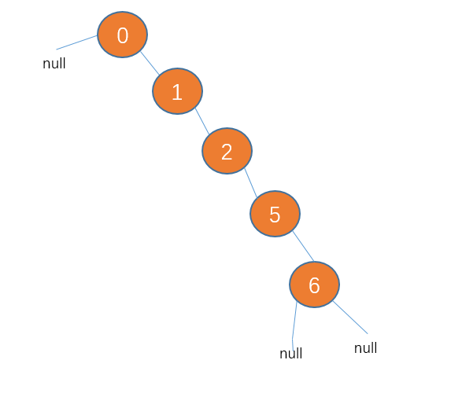

[TOC]

### CopyOnWriteArrayList

​		`ArrayList`不是线程安全的，线程安全的`Vector`和`Collections.synchronizedList`效率不高(都是用`synchronized`对每个方法加锁)，并发环境下应该用`CopyOnWriteArrayList`。

​		`CopyOnWriteArrayList`内部也是一个数组，但这个数组是以原子方式被整体更新的。**每次修改操作，都会新建一个数组，复制原数组的内容到新数组，在新数组上进行需要的修改，然后以原子方式设置内部的数组引用。**

​		在`CopyOnWriteArrayList`中，读不需要锁，可以并     行，读和写也可以并行，但多个线程不能同时写，每个写操作需要先获取锁。

```java
	public boolean add(E e) {
        //ReentrantLock加锁
        final ReentrantLock lock = this.lock;
        lock.lock();
        try {
            Object[] elements = getArray();
            int len = elements.length;
            Object[] newElements = Arrays.copyOf(elements, len + 1);
            newElements[len] = e;
            setArray(newElements);
            return true;
        } finally {
            lock.unlock();
        }
    }
```

​		**保证线程安全两种思路：加锁(`Synchronized`或`ReentrantLock`)、循环`CAS`，这里的写时复制是第3种思路。**

### CopyOnWriteArraySet

​		`CopyOnWriteArraySet`是基于`CopyOnWriteArrayList`来实现的，同样适用于读远多于写，集合不太大的场合。

## 跳表

### 跳表概述

​		跳表是一种可以进行二分查找的有序链表，在原有的有序链表上面增加了多级索引，通过索引来实现快速查找。

​		插入一个节点时，由抛硬币来决定新插入结点跨越的层数，如果抛出来的是正面，则继续抛，直到出现负面为止，统计这个过程中出现正面的次数，这个次数作为结点跨越的层数。

​		查找元素时，总是从最高层开始，每次都向右或者向下移动。

### 时间空间复杂度

​		时间复杂度：如果按照标准的跳表来看的话，每一级索引减少k/2个元素（k为其下面一级索引的个数），那么整个跳表的高度就是(log n)。查询时每次减少一半的元素，所以时间复杂度是O(log n)。

​		空间复杂度是O(n)。

### 跳表vs二叉树

​		二叉查找树是有可能出现一种极端的情况的，就是如果插入的数据刚好一直有序，那么所有节点会偏向某一边。

<div align="center">  </div><br>


这种接结构会导致二叉查找树的查找效率变为 O(n),这会使二叉查找树大打折扣。

### 跳表vs红黑树

		1. 红黑树比跳跃表复杂多了，学习成本大。
  		2. 红黑树插入，删除结点时，是通过调整结构来保持红黑树的平衡，比起跳跃表直接通过一个随机数来决定跨越几层，在时间复杂度的花销上是要高于跳跃表的。
  		3. 当要查找区间内所有元素时，在跳表中，要查找区间的元素，我们只要定位到两个区间端点在最低层级的位置，然后按顺序遍历元素就可以了，非常高效。而红黑树只能定位到端点后，再从首位置开始每次都要查找后继节点，相对来说是比较耗时的。

### ConcurrentSkipListMap

​		`TreeMap`对应的并发版本。`ConcurrentSkipListMap`是基于跳表实现的。没有使用锁，所有操作都是阻塞的，所有操作都可以并行，包括写，多线程可以同时写。

### ConcurrentSkipListSet

​		`TreeSet`对应的并发版本。`TreeSet`基于`TreeMap`实现，类似的，`ConcurrentSkipListSet`也是基于`ConcurrentSkipListMap`来实现。